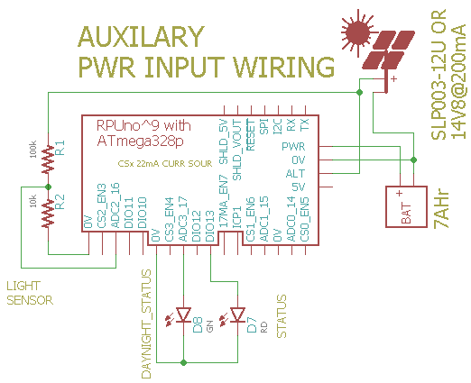

# Alternate Power Input

## Overview

Alternate power input is used to send current from a solar panel into a battery. 

The alternate power source needs to act as a current source, and the main power source needs to act like a battery. Do not attempt this with a bench power supply as the main power input. When the alternate power is enabled it must current limit and then charge the battery.

The DayNight state machine is used, it has two events that run a registered callback function. The day event turns on the alternate power input, while the night event turns it off. Adc channels are measured with a burst of interrupts that occurs every 100 millis. Near the time of the Adc burst, the mux channel PWR_V which is connected to an input voltage divider (a 1% 15.8k and a 0.1% 100k) is checked. This is more or less the battery voltage so can be used to turn off the Alternate power input when the battery has reached a limit, and then turn it back on when the voltage drops.

The hardware for this lacks training wheels, it is going to take some time to refine these ideas. The target battery is lead acid, this method fails with other types. 


## Wiring Needed




# Firmware Upload

With a serial port connection (set the BOOT_PORT in Makefile) and optiboot installed on the RPUlux run 'make bootload' and it should compile and then flash the MCU.

``` 
git clone https://github.com/epccs/RPUno/
cd /RPUno/Alternat
make bootload
...
avrdude done.  Thank you.
``` 

Now connect with picocom (or ilk).

``` 
#exit is C-a, C-x
picocom -b 38400 /dev/ttyUSB0
``` 

# Commands

Commands are interactive over the serial interface at 38400 baud rate. The echo will start after the second character of a new line. 


## /\[rpu_address\]/\[command \[arg\]\]

rpu_address is taken from the I2C address 0x29 (e.g. get_Rpu_address() which is included form ../lib/rpu_mgr.h). The value of rpu_address is used as a character in a string, which means don't use a null value (C strings are null terminated) as an adddress. The ASCII value for '1' (0x31) is easy and looks nice, though I fear it will cause some confusion when it is discovered that the actual address value is 49.

Commands and their arguments follow.


## /0/id? \[name|desc|avr-gcc\]

identify 

``` 
/1/id?
{"id":{"name":"Alternat","desc":"RPUno (14140^9) Board /w atmega328p","avr-gcc":"5.4.0"}}
```

##  /0/alt

This will toggle the Alternat Power enable

``` 
/1/alt
{"alt":"ON"}
```

##  /0/altcnt

This gives the number of times the charging limit was reached, it is a clue about how charged the battery is.

``` 
/1/altcnt
{"alt_count":"2"}
``` 

Example with limit set at 13.6V and 180mA solar pannel and 18AHr AGM battery. 

``` 
/1/alt
{"alt_en":"ON"}
/1/altcnt
{"alt_count":"0"}
/1/analog? 6,7
{"PWR_I":"0.019","PWR_V":"13.51"}
{"PWR_I":"0.019","PWR_V":"13.58"}
/1/altcnt
{"alt_count":"1"}
/1/analog? 6,7
{"PWR_I":"0.017","PWR_V":"13.51"}
{"PWR_I":"0.017","PWR_V":"13.47"}
{"PWR_I":"0.017","PWR_V":"13.47"}
{"PWR_I":"0.017","PWR_V":"13.47"}
{"PWR_I":"0.017","PWR_V":"13.47"}
{"PWR_I":"0.017","PWR_V":"13.51"}
{"PWR_I":"0.017","PWR_V":"13.58"}
/1/altcnt
{"alt_count":"2"}
/1/analog? 6,7
{"PWR_I":"0.017","PWR_V":"13.51"}
{"PWR_I":"0.017","PWR_V":"13.51"}
{"PWR_I":"0.017","PWR_V":"13.47"}
{"PWR_I":"0.017","PWR_V":"13.58"}
{"PWR_I":"0.017","PWR_V":"13.51"}
{"PWR_I":"0.017","PWR_V":"13.55"}
{"PWR_I":"0.017","PWR_V":"13.47"}
/1/altcnt
{"alt_count":"3"}
```


## [/0/analog? 0..7\[,0..7\[,0..7\[,0..7\[,0..7\]\]\]\]](../Adc#0analog-0707070707)
