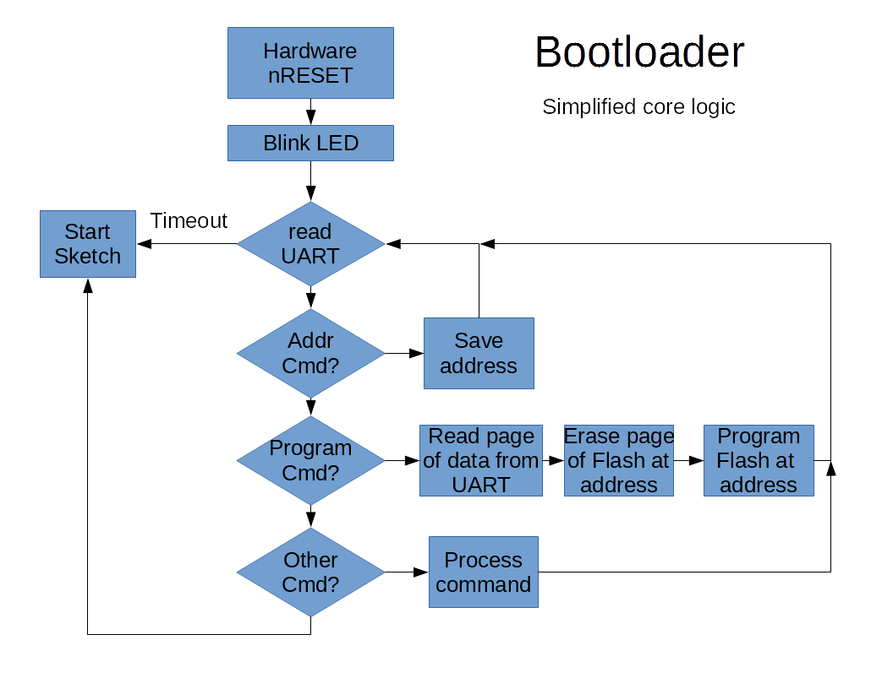

# Serial Bootloader

## Overview

AVR microcontrollers are usually programmed through an In-circuit Serial Programmer (ICSP/ISP), however with this firmware loaded in your microcontroller programing can be done over a serial interface (TX/RX) without the ICSP programmer. This is called serial bootloading. 



Unfortunalty to install a serial bootloader requires an ICSP tool. Arduino has an [ArduinoISP] sketch that I load into a Arduino Uno to use as an ICSP tool.

[ArduinoISP]: https://github.com/arduino/Arduino/blob/master/build/shared/examples/11.ArduinoISP/ArduinoISP/ArduinoISP.ino

It is a two step process. First run "make fuse" which will unlock the boot flash section and set fuses (LOW, HIGH, EXTENDED). The changed fuse setting will switch operation form the internal oscilator to the exteranl crystal, if it is missing the MCU will be locked up. The second step is "make isp" which will load the bootloader and lock the boot flash section, which should prohibit the Store Program Memory (SPM) instruction from running in the boot flash section. 

    WARNING: programing these fuse valuse will lock up the MCU when the crystal is missing or damaged.

## Firmware Upload

With ISP tool connected.

``` 
git clone https://github.com/epccs/RPUno/
cd /RPUno/Bootloader
make fuse
...
avrdude done.  Thank you.
make isp
...
avrdude done.  Thank you.
``` 

The bootloader is from MiniCore
https://github.com/MCUdude/MiniCore

