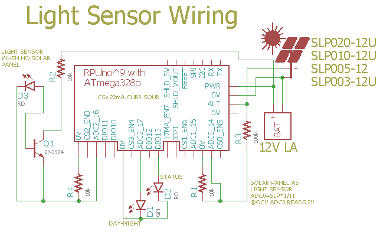

# Day-Night State Machine

## Overview

Use a red LED's photovoltaic voltage to approximately tell if it is day or night. 

Note: use the Day_AttachDayWork() and Night_AttachWork() functions to register a callback that will be run at the start of each day. This framework is how I debuged the day-night stat machine.


## Wiring Needed for Light Sensor



The LED is a CREE C503B-RCN-CW0Z0AA1. The LED works somewhat like a solar cell but it develops up to 1.6V with red light and shorter wavelengths. The LED will act as a current source to the NPN transistor base which will then do [common emitter current gain] which can be measured with ADC1 on R4. Over a very short time, the sun will move through the LED focus. Adding a diffuser reduces this effect and extends the day/night debounce to more appropriate times.

[common emitter current gain]: https://en.wikipedia.org/wiki/Bipolar_junction_transistor#Transistor_parameters:_alpha_(%CE%B1)_and_beta_(%CE%B2)

With a solar panel use a [voltage divider].

[voltage divider]: https://en.wikipedia.org/wiki/Voltage_divider


## Firmware Upload

With a serial port connection (see BOOTLOAD_PORT in Makefile) and optiboot installed on the RPUno run 'make bootload' and it should compile and then flash the MCU.

``` 
sudo apt-get install make git gcc-avr binutils-avr gdb-avr avr-libc avrdude
git clone https://github.com/epccs/RPUno/
cd /RPUno/DayNight
make bootload
...
avrdude done.  Thank you.
``` 

Now connect with picocom (or ilk). 

``` 
#exit is C-a, C-x
picocom -b 38400 /dev/ttyUSB0
``` 

# Commands

Commands are interactive over the serial interface at 38400 baud rate. The echo will start after the second character of a new line. 

## /\[rpu_address\]/\[command \[arg\]\]

rpu_address is taken from the I2C address 0x29 (e.g. ../Uart/id.h get_Rpu_address() ). The value of rpu_address is used as a character in a string, which means don't use a null value (C strings are null terminated), but the ASCII value for '1' (0x31) is easy and looks nice.

The STATUS_LED is bliked fast (twice per second) if the I2C address is not found, also the rpu_address defaults to '0'. 

Commands and their arguments follow.


## /0/id? \[name|desc|avr-gcc\]

Identify is from ../Uart/id.h Id().

``` 
/1/id?
{"id":{"name":"DayNight","desc":"RPUno Board /w atmega328p and LT3652","avr-gcc":"4.9"}}
```


## /0/day?

Report status of the state machine.

``` 
/1/day?
{"day_state":"DAY"}
... 11 hr
{"day_state":"DAY"}
{"day_state":"EVENING"}
... 15 min
{"day_state":"EVENING"}
TurnOnLED's
{"day_state":"NIGHT"}
... 12 hr
{"day_state":"NIGHT"}
{"day_state":"MORNING"}
... 15 min
{"day_state":"MORNING"}
WaterTheGarden
{"day_state":"DAY"}
... 20 hr (e.g. using an indoor lamp)
{"day_state":"DAY"}
{"day_state":"FAIL"}
```
