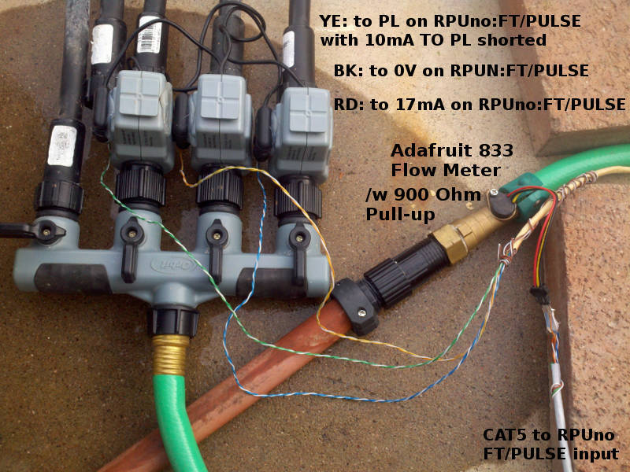
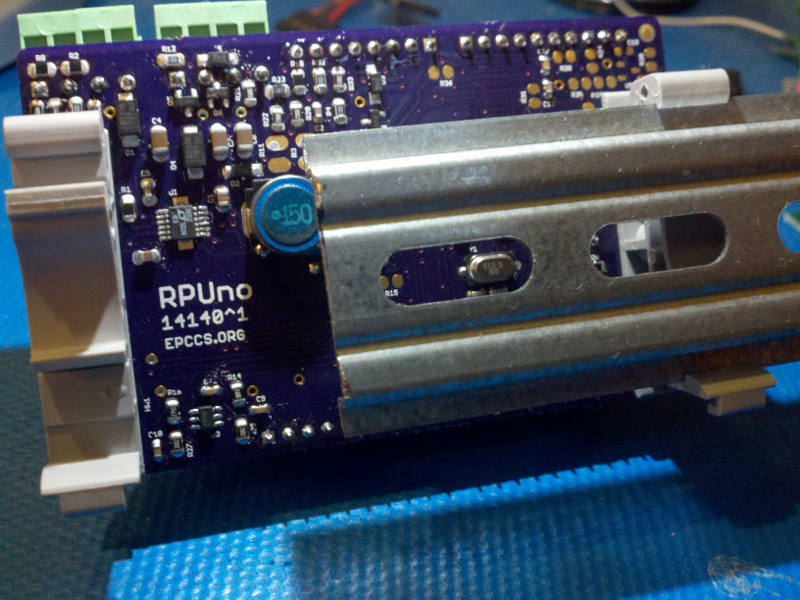

# Description

This shows the setup and method used for evaluation of RPUno.

# Table of References


# Table Of Contents:

1. [^9 Solenoid setup](#9-solenoid-setup)
1. [^9 NightLight setup](#9-nightlight-setup)
1. [^5 Flow Meter](#5-flow-meter)
1. [^6 AGM Battery](#6-agm-battery)
1. [^6 Power Example](#6-power-example)
1. [^5 Power Management](#5-power-management)
1. [^5 Day Night](#5-day-night)
1. [^5 Flow Meter](#5-flow-meter)
1. [^5 Solenoid FW Operates K3](#5-solenoid-fw-operates-k3)
1. [^5 ADC and DIO](#5-adc-and-dio)
1. [^5 Heat No Longer Problem](#5-heat-no-longer-problem)
1. [^4 Heat Wick](#4-heat-wick)
1. [^2 Log CCtest](#2-log-cctest)
1. [^2 Log PV_IN and PWR for a day](#2-log-pv_in-and-pwr-for-a-day)
1. [^2 20mA Loop With Open Collector To ICP1](#2-20ma-loop-with-open-collector-to-icp1)
1. [^1 Mounting](#1-mounting)


## ^9 Solenoid setup

Testing shows that the K3 drivers are working as expected. The back ported functions from NightLight seem to be working. This shows the setup that was used. 


The wiring detaials are (ICP1 not tested on bench, but it has not changed):


## ^9 NightLight setup

Schooling has a note regarding ^6 Solar. After removing the LT3652 and a few board revision latter I have a setup that can charge the battery directly from an alternate power supply. To evaluate this I had to get the software working for the new revion. On the bench I am using a supply set with a 200mA constant current mode. A 12V LA type battery is connected to the main power and the on board P-Channel MOSFET disconnects the supply when the batter is charged. Other details can be seen in the application source code and its notes. 


The RPUno^9 board has four current sources which can be enabled with the MCU digital pins (3..6). After the current goes through a string of LED it returns to the boards ground plane. 

The version of [NightLight_On^9] I am working with.

[NightLight_On^9]: (https://github.com/epccs/RPUno/tree/aeb3867bd7fa23a57e8a018410b56a7247100e4a/NightLight)

While building the LED strings I accidentally added a short to the wiring on a few strings and then hot glue and shrink wrap the short into a less than fun rework task. Fortunately, the current sources did their job with the battery voltage at about 13V so nothing smoked on the board. I am really liking the current source idea as a safety neet. 

Note that in the image K3 is also connected, but that is for sorting out the Solenoid firmware.


## ^5 Flow Meter

The Adafruit 833 has been running for almost a year at which point the electrical connector corroded and separated. I thought the meter was leaking but inspecting shows that the pressure regulator was the culprit.


I changed the flow meter with an Orbit 52212 that was gutted and the electronics [replaced] with a A1190 hall sensor. The leaking pressure regulater was also replaced and I am now ready for more testing (last batch is [K3^2log] ).

[replaced]: https://github.com/epccs/Document/tree/master/FlowMeter
[K3^2log]: ./K3^2log.txt


## ^6 AGM Battery


10AHr AGM Sealed battery used with a SLP003-12U. Note the AGM will not charge with the thermistor so I am letting it run without temperature compensation (i.e. the thermistor is an open circuit). The charger voltage tops out at about 14.3V which should not cause much hydrogen gassing, but it will cause some. It is my understanding that the AGM will recover the gassing and allow the battery to keep working, however, it is also my understanding that the catalyst will stop working at some point. The question to ask is if this is a good compromise between damage from sulfation and damage from using up the AGM catalyst.

After running the [NightLight] for a few weeks ([RPUno^6NightLight_log]) I pulled the battery just before the sun went down and tried to charge it with a Duracell SLC10003 charger, it decided the battery was at a full charge within a few minutes. The SLC10003 goes to 14.5V with 1.5A so I guess the 150mA is doing the job even though I don't see it even reach 14.3V. 

[NightLight]: https://github.com/epccs/RPUno/tree/master/NightLight
[RPUno^6NightLight_log]: ./RPUno^6NightLight_log.txt

## ^6 Power Example


A power setup evaluation. Note that hot glue (a.k.a. thermoplastic) is used to hold the thermistors in place. I find that the hot glue peels off when I want to move the thermistor. 

## ^5 Power Management

The RPUno controls power from the battery to its VIN pin with digital IO2. On the [RPUpi] shield that power is provided to an SMPS that provides 5V at up to 1A to the Pi Zero header. Wait... don't just pull the plug, the correct way is to halt the Pi Zero and then wait for it to stop. The time it takes to halt depends on the running applications. The best handshake I have figured out is to wait for thirty seconds and then watch that the load current from the RPUno battery has stabilized as demonstrated with this [Power Management] firmware.

[Power Management]: https://github.com/epccs/RPUno/tree/master/PwrMgt
[RPUpi]: https://github.com/epccs/RPUpi

The [RPUpi] has a shutdown button that pulls down BCM6 (header pin 31) on the Pi Zero. BCM6 is used by a Python [Shutdown] script to halt the computer. For testing, I've loaded the bus manager with the [Remote]* firmware that places a weak pull up on its PB0 (ICP1) pin which is also tied to that BCM6 pin through a 1.8k resistor. As a result, both a manual or bus manager initiated halt can occur. The RPUno must check for a manual halt by reading the shutdown_detected flag from the bus manager as demonstrated with the [Power Management] firmware.

    * Note: at this time I used Remote from RPUadpt (a port was not needed)

[Shutdown]: https://github.com/epccs/RPUpi/tree/master/Shutdown
[Remote]: https://github.com/epccs/RPUadpt/tree/master/Remote

The RPUno also controls power to the FT/Pulse sensor current sources with digital IO9 and is also demonstrated with the [Power Management] firmware.


## ^5 Day Night

A [Day-Night] state machine with a callback that is run after the morning debounce. [Solenoid] has been changed to use the callback to load the saved solenoid settings (same as Flow Meter evaluation) and starting solenoid valve control state machine. What follows is a log from some different days while I've let the RPUno loaded with the Solenoid program do its thing. The date and times are when I used picocom to log the data.

[Day-Night]: https://github.com/epccs/RPUno/tree/master/DayNight

I let an RPUno^4 operate three Orbit 58874N valves from 12/17/2016 to 2/4/2017 using the day-nigh state machine to start operation of the three valves ten times each for ten seconds. [K3^0log] has the data, but some days are missing for various reasons (e.g. mostly I forgot to read it).

[K3^0log]: ./K3^0log.txt


## ^5 Flow Meter

With the solenoid setup working it is time to initialize ICP1 and add [Capture] commands to the [Solenoid] program, which allows connecting a flow meter to the pulse capture input to see the pulse counts from the flow meter. I have an [Adafruit PID:833] meter that has a small turbine and a hall sensor with an open drain output and 900 Ohm pullup. Each pulse is about 2 milliliters. After the initialization that happens when reset occurs I see over 400 pulses went through each zone (e.g. in 1 second).

[Capture]: https://github.com/epccs/RPUno/tree/master/Capture
[Adafruit PID:833]: https://www.adafruit.com/product/833




UPDATE 2/5/2017: The flow meter has a pull-up so I did not need to use the 10mA pull-up on the board, which seems to be part of the reason why the 3W PV was not keeping the battery charged.

```
/1/flow? 1
{"K1":{"cycle_state":"0","cycles":"0","flow_cnt":"405"}}
/1/flow? 2
{"K2":{"cycle_state":"0","cycles":"0","flow_cnt":"415"}}
/1/flow? 3
{"K3":{"cycle_state":"0","cycles":"0","flow_cnt":"414"}}
```

The Capture program has the capture unit prescale set to the MCU clock speed, so that was what I started with for the Solenoid program. The event timing shows the prescale needs set, which will not change the counts only the event times. The status also shows both rising and falling edge was captured, and that is a wake up call... I am counting both events (opps).

```
/1/event? icp1,6
{"icp1":{"count":"1643","event":"51796","status":"1"}}
{"icp1":{"count":"1642","event":"20072","status":"0"}}
{"icp1":{"count":"1641","event":"8183","status":"1"}}
{"icp1":{"count":"1640","event":"60309","status":"0"}}
{"icp1":{"count":"1639","event":"52793","status":"1"}}
{"icp1":{"count":"1638","event":"53660","status":"0"}}
/1/initICP icp1,rise,3
/1/run 1
{"K1":{"delay_start_sec":"3","runtime_sec":"10","delay_sec":"40","cycles":"10"}}
/1/stop 1
{"K1":{"stop_time_sec":"3"}}
/1/run 1,1
{"K1":{"delay_start_sec":"1","runtime_sec":"1","delay_sec":"1","cycles":"1"}}
/1/flow? 1
{"K1":{"cycle_state":"0","cycles":"0","flow_cnt":"244"}}
/1/event? icp1,31
{"icp1":{"count":"793","event":"29682","status":"1"}}
{"icp1":{"count":"792","event":"56369","status":"1"}}
{"icp1":{"count":"791","event":"40079","status":"1"}}
{"icp1":{"count":"790","event":"30084","status":"1"}}
{"icp1":{"count":"789","event":"23288","status":"1"}}
{"icp1":{"count":"788","event":"18644","status":"1"}}
{"icp1":{"count":"787","event":"15244","status":"1"}}
{"icp1":{"count":"786","event":"12683","status":"1"}}
{"icp1":{"count":"785","event":"10543","status":"1"}}
{"icp1":{"count":"784","event":"8676","status":"1"}}
{"icp1":{"count":"783","event":"6931","status":"1"}}
{"icp1":{"count":"782","event":"5256","status":"1"}}
{"icp1":{"count":"781","event":"3614","status":"1"}}
{"icp1":{"count":"780","event":"2017","status":"1"}}
{"icp1":{"count":"779","event":"432","status":"1"}}
{"icp1":{"count":"778","event":"64420","status":"1"}}
{"icp1":{"count":"777","event":"62890","status":"1"}}
{"icp1":{"count":"776","event":"61391","status":"1"}}
{"icp1":{"count":"775","event":"59886","status":"1"}}
{"icp1":{"count":"774","event":"58407","status":"1"}}
{"icp1":{"count":"773","event":"56932","status":"1"}}
{"icp1":{"count":"772","event":"55480","status":"1"}}
{"icp1":{"count":"771","event":"54010","status":"1"}}
{"icp1":{"count":"770","event":"52560","status":"1"}}
{"icp1":{"count":"769","event":"51093","status":"1"}}
{"icp1":{"count":"768","event":"49635","status":"1"}}
{"icp1":{"count":"767","event":"48173","status":"1"}}
{"icp1":{"count":"766","event":"46714","status":"1"}}
{"icp1":{"count":"765","event":"45234","status":"1"}}
{"icp1":{"count":"764","event":"43767","status":"1"}}
{"icp1":{"count":"763","event":"42286","status":"1"}}
```

This is good feedback, each zone has a flow count to show it is working. I have also used this meter on a previous setup and the numbers look reasonable. Some things to note. One is that as the valve is closed the time between events will cause the 16-bit timer to overflow for the most recent events (even with prescale set at MCU clock/64). Another is that I have a nasty turbulent flow going through the turbine that spins a magnet and triggers the hall sensor, so the timing has astonishingly high jitter (which indicates issues with pulse interpolation techniques).

After a rebuild and upload. Remember I'm sitting at my desk using an SSH session to the Linux box on my test bench, which is connected to an RPUftdi shield that has a CAT5 cable going out to the RPUno with an RPUadpt shield in the garden... I almost feel like I have a clue what I'm doing. But it fades fast when I find the board on my bench got the update because I forgot to tell the bus manager which device I wanted to load and thus nuked the i2c-debug program on the bench board that is used to tell the RPUftid bus manager what remote address to load. Clearly, this needs improvements.

I operate the valves manually by loading settings from the EEPROM and running them. Ten cycles of 10 Second duration spread by a 40 Second delay between cycles. The delay_start only occurs once so that I can start the watering cycles later in the day when it gets warm. 

```
/1/load 1
{"K1":{"delay_start_sec":"3","runtime_sec":"10","delay_sec":"40","cycles":"10"}}
/1/run 1
{"K1":{"delay_start_sec":"3","runtime_sec":"10","delay_sec":"40","cycles":"10"}}
/1/load 2
{"K2":{"delay_start_sec":"16","runtime_sec":"10","delay_sec":"40","cycles":"10"}}
/1/run 2
{"K2":{"delay_start_sec":"16","runtime_sec":"10","delay_sec":"40","cycles":"10"}}
/1/load 3
{"K3":{"delay_start_sec":"29","runtime_sec":"10","delay_sec":"40","cycles":"10"}}
/1/run 3
{"K3":{"delay_start_sec":"29","runtime_sec":"10","delay_sec":"40","cycles":"10"}}
```

Wait for 10 minutes while it runs

```
/1/flow? 1
{"K1":{"cycle_state":"0","cycles":"0","flow_cnt":"16335"}}
/1/time? 1
{"K1":{"cycle_state":"0","cycles":"0","cycle_millis":"100000"}}
/1/flow? 2
{"K2":{"cycle_state":"0","cycles":"0","flow_cnt":"17773"}}
/1/time? 2
{"K2":{"cycle_state":"0","cycles":"0","cycle_millis":"100000"}}
/1/flow? 3
{"K3":{"cycle_state":"0","cycles":"0","flow_cnt":"17076"}}
/1/time? 3
{"K3":{"cycle_state":"0","cycles":"0","cycle_millis":"100001"}}
```

So that is about 34 Liters (9 gallons) to each zone during a 100 second period. The flow_cnt could be calibrated to figure out the flow meter K factor, but that is not a concern yet.


## ^5 Solenoid FW Operates K3

An interactive Command Line Interface for [Solenoid] control is wired to LED's to see its function. In my [reset all video] each solenoid is cycled twice (opps), but the logic control is working. After connecting the K3 board I fixed the control program so it cycles each solenoid once as seen when [RPUno with K3 video] is seen. 
    
[Solenoid]: https://github.com/epccs/RPUno/tree/master/Solenoid
[reset all video]: http://rpubus.org/Video/14140%5E5_SolenoidResetAllLogic.mp4
[RPUno with K3 video]: http://rpubus.org/Video/14140%5E5WithK3%5E0.mp4


Update1: Added more options to the [Solenoid] program that save/load settings to/from EEPROM and connected some of Orbits (58874N) latching valves (which work for me with a 24V 50 mSec pulse). Have a look at the [video of RPUno (modified ^4) with K3 controlling some latching valves].

[video of RPUno (modified ^4) with K3 controlling some latching valves]: http://rpubus.org/Video/14140%5E4_K3%5E0_WithLatchingValves.mp4


Update2: Added day/night state machine to the [Solenoid] program, which loads saved settings from EEPROM after a morning (debounce) at the start of each day, and starts their operation. 


## ^5 ADC and DIO

Interactive Command Line Interface for [Analog] updated, and for [Digital] created. 

[Analog]: https://github.com/epccs/RPUno/tree/master/Adc
[Digital]: https://github.com/epccs/RPUno/tree/master/Digital


## ^5 Heat No Longer Problem

Heat is no longer a problem. Testing shows it will do 1.3A all day with the thermistor (R23) placed off-board (e.g. the green-white wire), and shuts down when R23 is heated to 40 degC.


## ^4 Heat Wick

In order to run a Raspberry Pi, I will need to push the solar charge controller more than in the past. Testing shows it will do 1.28A but then gets hot and with the thermistor R23 in place shuts down after a few minutes. It starts back up after cooling down, but I need to wick more of the heat away and keep it running.


## ^2 Log CCtest

Overview of setup: the solar PV (SLP003-12U) is on roof (that white roof coating is impossible  to photo)


Enclosure with RPUno^2, RPUadpt^1 (used for point to point RS422), and CCtest^1 clipped on DIN rail


CCtest^0 boad is wired to RPUadpt^1 board 

```
{Load LD[0:3]:DIO[10:13], ADC:{PV:ADC1,CHRG:ADC3,DISCHRG:ADC2}}
```


Using an interactive command line [CCtest] firmware to log the charge control and load test. I'm not happy with how the test works. I started the test in the evening when the PV was bellow 18V, so I connected a 24V wall wart. I had to keep it connected to hold the input above 18V or the load stepping stops. It stopped at step 9 after I unplugged the wall wart and considered what had happened and if I needed to start over. I need to improve the test, and then everything bellow will get updated... anyway, the data is still interesting.

[CCtest]: https://github.com/epccs/RPUno/tree/master/CCtest

 The data that follows was recorded in a terminal session:

```
/0/cctest?
{"DIS_A":"0.013","PV_V":"12.75","PWR_V":"6.52","TIME":"5","LD":"0"}
{"PV_A":"0.260","CHRG_A":"0.780","PV_V":"18.34","PWR_V":"6.67","TIME":"82119","LD":"1"}
{"DIS_A":"0.040","PV_V":"21.72","PWR_V":"6.56","TIME":"84118","LD":"2"}
{"DIS_A":"0.050","PV_V":"24.03","PWR_V":"6.51","TIME":"86119","LD":"3"}
{"DIS_A":"0.057","PV_V":"24.03","PWR_V":"6.50","TIME":"88120","LD":"4"}
{"DIS_A":"0.066","PV_V":"24.03","PWR_V":"6.50","TIME":"90121","LD":"5"}
{"DIS_A":"0.073","PV_V":"24.03","PWR_V":"6.50","TIME":"92122","LD":"6"}
{"DIS_A":"0.080","PV_V":"24.03","PWR_V":"6.50","TIME":"94124","LD":"7"}
{"DIS_A":"0.088","PV_V":"22.05","PWR_V":"6.49","TIME":"96124","LD":"8"}
{"DIS_A":"0.073","PV_V":"18.55","PWR_V":"6.48","TIME":"108335","LD":"9"}
{"DIS_A":"0.102","PV_V":"21.30","PWR_V":"6.48","TIME":"110337","LD":"10"}
{"DIS_A":"0.112","PV_V":"24.03","PWR_V":"6.47","TIME":"112337","LD":"11"}
{"DIS_A":"0.119","PV_V":"24.03","PWR_V":"6.47","TIME":"114338","LD":"12"}
{"DIS_A":"0.128","PV_V":"24.03","PWR_V":"6.47","TIME":"116339","LD":"13"}
{"DIS_A":"0.136","PV_V":"24.03","PWR_V":"6.46","TIME":"118340","LD":"14"}
{"DIS_A":"0.144","PV_V":"24.03","PWR_V":"6.46","TIME":"120341","LD":"15"}
{"DIS_A":"0.151","PV_V":"24.03","PWR_V":"6.45","TIME":"122342","LD":"15"}
{"DIS_A":"0.151","PV_V":"24.03","PWR_V":"6.45","TIME":"124343","LD":"15"}
{"DIS_A":"0.128","PV_V":"24.03","PWR_V":"6.45","TIME":"130519","LD":"15"}
{"DIS_A":"0.128","PV_V":"0.31","PWR_V":"6.39","TIME":"4983617","LD":"15"}
{"DIS_A":"0.128","PV_V":"0.26","PWR_V":"6.34","TIME":"17049416","LD":"15"}
{"DIS_A":"0.129","PV_V":"0.23","PWR_V":"6.30","TIME":"30075304","LD":"15"}
/0/cctest?
{"PV_A":"0.131","CHRG_A":"0.269","PV_V":"15.27","PWR_V":"6.41","TIME":"56850744","LD":"0"}
/0/cctest?
{"PV_A":"0.145","CHRG_A":"0.292","PV_V":"15.40","PWR_V":"6.63","TIME":"59078028","LD":"0"}
/0/cctest?
{"PV_A":"0.154","CHRG_A":"0.312","PV_V":"15.43","PWR_V":"6.67","TIME":"61687246","LD":"0"}
/0/cctest?
{"PV_A":"0.152","CHRG_A":"0.307","PV_V":"15.48","PWR_V":"6.69","TIME":"63693940","LD":"0"}
/0/cctest?
{"PV_A":"0.105","CHRG_A":"0.233","PV_V":"17.12","PWR_V":"6.68","TIME":"66580132","LD":"0"}
/0/cctest?
{"PV_A":"0.105","CHRG_A":"0.234","PV_V":"17.14","PWR_V":"6.69","TIME":"66661628","LD":"0"}
```

The time is from the millis() function. I sent a carriage return to stop the load because I want to see how it charged after that. It switches to float slowly, so I need to see that better. Loaded [Adc] firmware.

This shows 20Sec intervals of what the ATmega328 ADC can see as the charge control  (LT3652) switches from bulk charge to float charge.

```
/0/analog? 7,6,3,2,1
{"PWR_V":"6.59","PV_V":"15.12","DISCHRG_A":"0.000","CHRG_A":"0.293","PV_A":"0.146"}
{"PWR_V":"6.64","PV_V":"15.22","DISCHRG_A":"0.000","CHRG_A":"0.293","PV_A":"0.146"}
{"PWR_V":"6.66","PV_V":"15.27","DISCHRG_A":"0.000","CHRG_A":"0.292","PV_A":"0.145"}
{"PWR_V":"6.67","PV_V":"15.30","DISCHRG_A":"0.000","CHRG_A":"0.294","PV_A":"0.146"}
{"PWR_V":"6.68","PV_V":"15.46","DISCHRG_A":"0.000","CHRG_A":"0.296","PV_A":"0.145"}
{"PWR_V":"6.69","PV_V":"16.08","DISCHRG_A":"0.000","CHRG_A":"0.279","PV_A":"0.132"}
{"PWR_V":"6.69","PV_V":"16.42","DISCHRG_A":"0.000","CHRG_A":"0.264","PV_A":"0.122"}
{"PWR_V":"6.68","PV_V":"16.68","DISCHRG_A":"0.000","CHRG_A":"0.251","PV_A":"0.115"}
{"PWR_V":"6.68","PV_V":"16.73","DISCHRG_A":"0.000","CHRG_A":"0.244","PV_A":"0.112"}
{"PWR_V":"6.68","PV_V":"16.78","DISCHRG_A":"0.000","CHRG_A":"0.240","PV_A":"0.109"}
{"PWR_V":"6.69","PV_V":"16.83","DISCHRG_A":"0.000","CHRG_A":"0.234","PV_A":"0.106"}
{"PWR_V":"6.68","PV_V":"16.91","DISCHRG_A":"0.000","CHRG_A":"0.228","PV_A":"0.103"}
{"PWR_V":"6.69","PV_V":"17.01","DISCHRG_A":"0.000","CHRG_A":"0.227","PV_A":"0.102"}
{"PWR_V":"6.68","PV_V":"17.12","DISCHRG_A":"0.000","CHRG_A":"0.223","PV_A":"0.099"}
{"PWR_V":"6.68","PV_V":"17.17","DISCHRG_A":"0.000","CHRG_A":"0.217","PV_A":"0.096"}
{"PWR_V":"6.68","PV_V":"17.17","DISCHRG_A":"0.000","CHRG_A":"0.213","PV_A":"0.095"}
```

## ^2 Log PV_IN and PWR for a day

Overview of setup: the solar PV (SLP003-12U) is on the trash container


Inside the box an RPUadpt board is setup for point to point and connected to a long CAT5 cable that runs to a Linux box running the terminal session. The battery used is was a 6V SLA with 7AH capacity (Power-Sonic PS-670)


Using an interactive command line program to log the solar input voltage (PV_IN) and the battery voltage (PWR). The interval between reading is 60 seconds, which was set in the [Adc]. The raw data was recorded in a terminal session:

[Adc]: https://github.com/epccs/RPUno/tree/master/Adc

```
 rsutherland@straightneck:~/Samba/RPUno/Adc$ script -f -c "picocom -b 115200 /dev/ttyUSB0" [14140^2_ADC60SecInterval.log](./14140^2_ADC60SecInterval.log)
```

Exta line feeds? the UART stdio redirect needs some more work (done), anyway they can be removed:

```
grep -v '^[[:space:]]*$' 14140^2_ADC60SecInterval.log > 14140^2_ADC60SecInterval.log.clean
```

Next use one of the JSON to CVS converters, and then it can be opened with LibreOffice Calc (version 5.0.6.3) and graphed.


In the morning, I found the solar PV just outside of the light so I moved it into the light and then the bulk charge was so fast it is barely noticeable on the graph (line 1711 in raw data). During bulk charging the PV is held at the MPPT voltage (16.8V) which decreases some with temperature. After bulk changing the battery is held at a temperature dependent absorption voltage. SLA batteries should have one to three hours per day at the absorption voltage. Missing a few days will not end the battery, but some sulfation deposits occur on those days. Sulfation is simple to understand it is like the lime deposits in a hot water heater, some of the lead sulfide dissolves (like lime) in the battery water, and then when the battery heats up in the morning it deposits in places that don't participate in the charging process. Absorption removes the lead sulfide from the battery water, and it will take some time to dissolve (and saturate the solution).


## ^2 20mA Loop With Open Collector To ICP1

The 20mA current source provides 17.5mA of current, which is acceptable (I don't want to increase it until a few more are seen). An HT^1 is shown operating on the loop in the image.


The scope shows the HT sensor in a pool of water with some ice. The important thing  is that the ICP1 pin is pulled down by an open collector when the loop current is over 6.5mA.


Basically this shows that this event loop is a good direction to proceed.


## ^1 Mounting

DIN rail is often used with industrial control equipment. It makes mounting very easy. Unmounting is also easy since there is a place for a flat blade screwdriver to lever the plastic mounting latch away from the DIN rail. 



RPUftdi, RPUadpt shield also need to mount.


