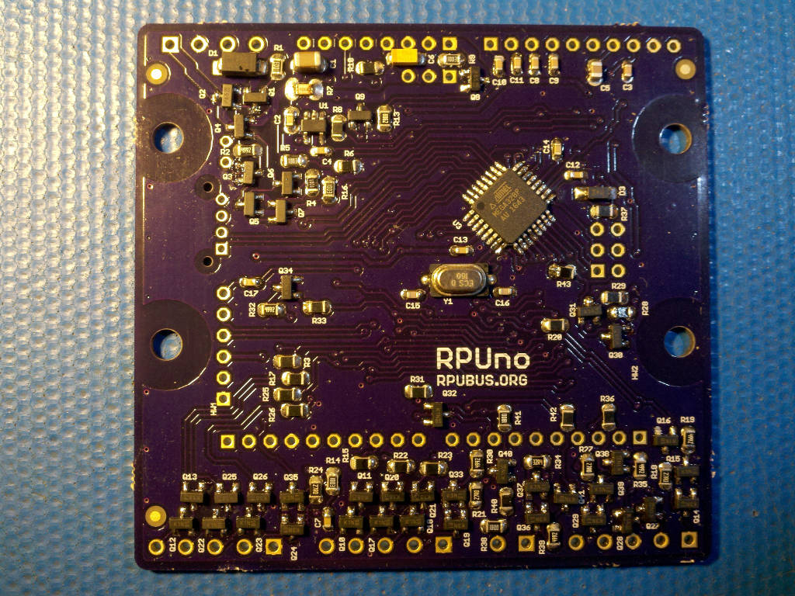
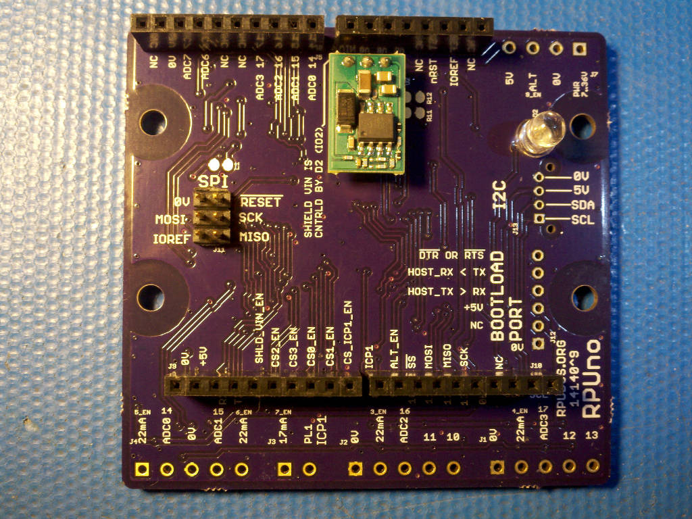
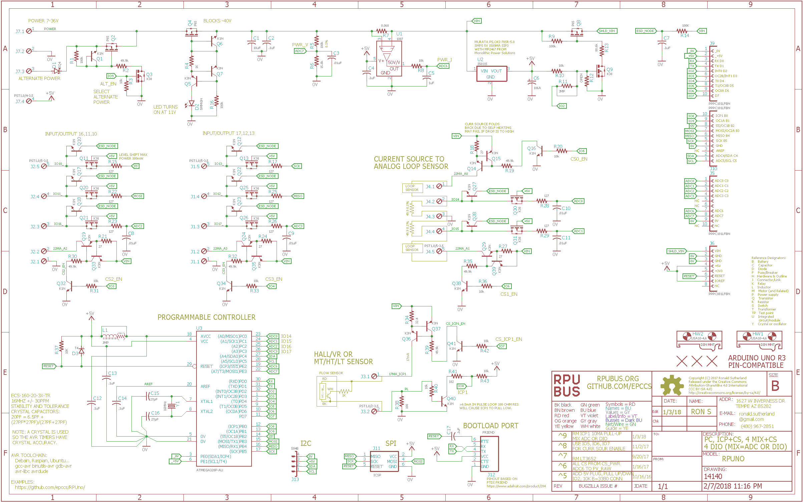

# Hardware

## Overview

This board has an ATmega328p microcontroller. The board is DIN mounted and has pluggable connectors for some functions. Six Digital input/output (in two groups of three plus a current source) are connected through level shifting transistors to the pluggable connectors. Two ADC inputs (each with a current source) are connected to the pluggable connectors. Capture hardware (ICP1) with current source is connected to pluggable connector. The board power can be from 7 thru 36 VDC and is protected against reverse polarity with a P-channel Mosfet. The input power voltage can be measured with ADC channel 7 and the input power current can be measured with ADC channel 6. Power to the shield VIN pin may be disabled by setting digital IO2 low. An ATmega328p can be programmed with the GCC toolchain for AVR found in Debian packages (e.g. so it is available on, Ubuntu, Raspbian, OSH via brew, Windows via Windows Subsystem for Linux).

Bootloader options include [optiboot] and [xboot]. Uploading through a bootloader eliminates fuse setting errors and there are not many ways to block an upload accidentally (e.g. some other bootloaders do not clear the watchdog and can get stuck in a loop). This has given the feel of robustness during my software development experience.

[optiboot]: https://github.com/Optiboot/optiboot
[xboot]: https://github.com/alexforencich/xboot

## Inputs/Outputs/Functions

```
        ATmega328p programs are compiled with open source tools that run nearly everywhere.
        Input power can range from 7 to 36V DC
        High side current sense on input power connected to ADC6.
        Input power voltage is divided down and connected to ADC7.
        Six pluggable digital input/outputs (DIO 3,4,10,11,12,13) with level conversion.
        Digital interface has two 22 mA current source
        Input Capture (ICP1) with current sources for current loops.
        Two Analog channels ADC0, ADC1.
        Two current sources for analog loops are enabled with a digital control DIO 9.
        ICP and ADC current sources are enabled with a digital control DIO 9.
        Power to the Shield Vin pin is turned off with DIO 2.
        MCU power (+5V) is converted with an SMPS from the input power.
        Up to an Amp can be safely used from the +5V.
```

## Uses

```
        Data Acquisition using Capture Hardware (ICP1).
            Flow Meter
            Rotating Hardware
            PWM Output Temperature Sensors
            PWM Output Capacitance Sensors
        Automation
            Clear a latch-up on a device powered with the shield VIN pin.
            Solid State Relay String (e.g. multi-phase power) control.
            PLC replacement that is programmed with an open source toolchain.
```

## Notice

```
        ADC4 and ADC5 are used for I2C exclusively and not connected to the analog header.
        AREF from ATmega328p is not connected to the header.
        3V3 is not present on the board, the header pin is not connected.
```


# Table Of Contents

1. [Status](#status)
2. [Design](#design)
3. [Bill of Materials](#bill-of-materials)
4. [Assembly](#assembly)
5. [How To Use](#how-to-use)


# Status


```
        ^7  Done: Design, Layout, BOM, Review*, Order Boards, Assembly,
            WIP: Testing,
            Todo:  Evaluation.
            *during review the Design may change without changing the revision.
            use an ESD_NODE like Irrigate7.
            don't turn off the current source used with digital outputs since the digital IO's can do that. 
            DIO protection resistor (change 182 Ohm to 127 Ohm)
            remove LT3652 and reduce size of board.
            add an IDC connector for everything that was used with LT3652 (5,6,7,ADC2,ADC3).
            add JSK plug for I2C

        ^6  two test units (T1,T2) made, four units made to see if anyone is intrested.
            location: 2017-3-24 T1^6 damaged MCU while taking power example image.
                    2017-3-25 T2^6 using on test bench.
                    2017-6-12 T1^6 replaced MCU from a scrped RPUno^4 and tested again.
                    2017-7-19 T2^6 + RPUadpt^5 in SEncl NightLight testing.
                    2017-8-26 T2^6 NightLight ended, unit is in an enclosure with battey but is not in use.


        ^5  only unit of this version made
            location: 2016-12-18 Test Bench /w an RPUpi^1, start power management testing
                    2017-1-1 had ADC7 parts (and BOM) changed to measre battery.
                    2017-1-5 had ADC6 hacked to measure raw PV.
                    2017-2-4 moved to SWall Encl /w K3^1, RPUadpt^4, SLP003-12U, 12V battery.
                    2017-3-19 remove 10k thermistor which was used by  LT3652 to turn off chrg when over 40 C
                    2017-4-17 running Solenoid fw, @ SWall Encl, Update K3^2, Update RPUadpt^5, SLP003-12U, 12V battery.
```

Debugging and fixing problems i.e. [Schooling](./Schooling/)

Setup and methods used for [Evaluation](./Evaluation/)


# Design

The board is 0.063 thick, FR4, two layer, 1 oz copper with ENIG (gold) finish.






## Electrical Parameters

```
Power Voltage: 7 thru 36V
```

## Mounting

```
        DIN rail
```

## Electrical Schematic



## Testing

Check correct assembly and function with [Testing](./Testing/)


# Bill of Materials

Import the [BOM](./Design/14140,BOM.csv) into LibreOffice Calc (or Excel) with semicolon separated values, or use a text editor.


# Assembly

## SMD

The board is assembled with CHIPQUIK no-clean solder SMD291AX (RoHS non-compliant). 

The SMD reflow is done in a Black & Decker Model NO. TO1303SB which has the heating elements controlled by a Solid State Relay and an ATMega328p loaded with this [Reflow] firmware.

[Reflow]: https://github.com/epccs/RPUno/tree/master/Reflow


# How To Use

Connect the application electronics (e.g. flow meter, analog current loops, and whatever the application uses) and check the connections. Then connect the input power.  

+5V power on J7 is not populated, when I use the power from this point I solder some wires to the through holes, it is risky to populate the pluggable connector next to the input power.

This board is like an Arduino Uno, but some functions are dedicated to the onboard hardware. Three digital lines (IO5, IO6, IO7) and two analog channels (ADC3, ADC2) are reserved for off board options. Two digital lines (IO2, IO9) are used to control power to the SHLD_VIN and current sources for ICP and ADC. Two analog channels (ADC4, ADC5) are dedicated for I2C (and not wired to the analog header). While two analog channels (ADC7, ADC6) are used to measure the power input voltage and current.

The [Solenoid] firmware is looking fairly interesting, it is a solenoid control state machine with some of the states using a timer with a programmed value. [Solenoid] also reads a flow sensor on ICP1 in order to accumulate the flow count (i.e. the pulse count from a flow meter) for an irrigation zone feed by the solenoid valve. It allows operating the valves several times with a delay between each operation. This should allow the drip irrigation to be done in small doses several times (e.g. 10 times with 5-minute watering and hour delays between watering) during the day, rather than in one big pool (i.e. for 50 minutes). The idea is to give the vegetables a chance to use the water before it sinks bellow where their roots have access. In the soil in my yard, the water sinks in fairly quick. 

[Solenoid]: https://github.com/epccs/RPUno/tree/master/Solenoid

## Solar

Previous versions of this board included a solar charge controller, which has been removed. My experiments have confirmed that charging a battery can be done directly through a diode when the PV charge is less than or about .02C (e.g. 200mA into a 10AHr battery). This means that the need for a charge controller depends on how the user wants to ratio the PV and battery storage. The charge controller I was using worked fine, but it was doing nothing for a SLP003-12U panel on a 10AHr AGM battery that a diode alone would not do. 

Regarding the MPPT function, it turns out that a 15% power loss through the buck converter is a wash when compared to operating the PV at the battery voltage for room temperature conditions (e.g. PV MPP 16.2V and bat is 13.8V), and at a higher temperature, losses from buck power conversion favors a direct connection. The LT3652 is a fine chip but there needs to be a sizable voltage change from the solar panel to the battery voltage for it to be beneficial.

