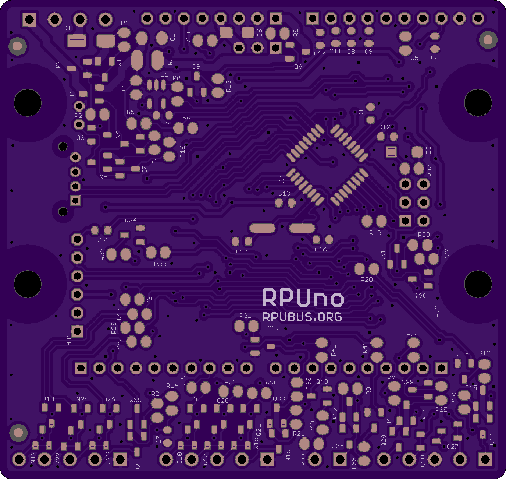
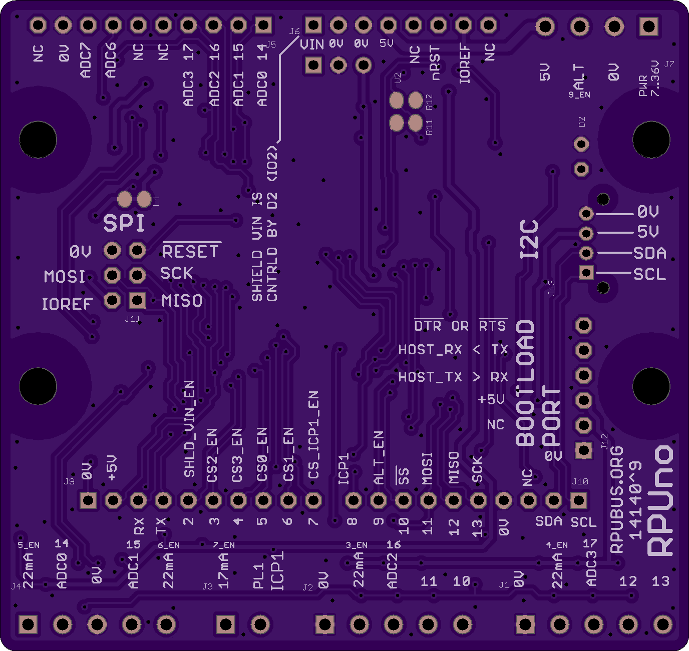

# Hardware

## Overview

This board is solar powered and has an ATmega328p. The Capture (ICP1) hardware is connected to an inverting open collector transistor that pulls down the ICP1 pin when current (e.g. 10mA) is flowing through a 100 Ohm sense resistor. The captured value is accurate to within one crystal count of the event (e.g. pulse edge caused by the transition of 3mA to 10mA from a current loop or a sensor output goes open after it was a shunt for the 10mA source). This captured value is an excellent data acquisition of flow meter pulses or for other pulse interpolation task. The board also has six digital interfaces with voltage level conversion up to the board's internal supply voltage (VIN on schematic), and two analog inputs with current sources for two current loops. The ATmega328p can be programmed with the AVR toolchain on Ubuntu, Raspbian, and others.

Bootloader options include [optiboot][1] and [xboot][2]. Uploading through a bootloader eliminates fuse setting errors and the bootloader over full duplex can not be blocked by accidental register settings, thus adding a feel of robustness to the user's experience during software development.

[1]: https://github.com/Optiboot/optiboot
[2]: https://github.com/alexforencich/xboot

## Inputs/Outputs/Functions

```
        ATmega328p is a minimalistic easy to use microcontroller
        12V SLA with an LT3652 solar charge controller 
        High side battery current sensing ADC2 (Charging) and ADC3 (Discharging).
        Vin power will automatically disconnect when the battery is low.
        Six pluggable digital input/outputs (DIO 3,4,10,11,12,13) with level conversion clamped to Vin.
        Digital interface has a 22 mA current source from Vin (do not use the battery directly)
        Pulse input for capacitive sensors HT, LT, MT, PT, VR, or OneShot.
        Optinal 10mA source for use with flow meters that have an open collector output.
        Two Analog Loops each with current sources from Vin.
        Power off control to FT/Pulse (IO9) and Vin to Shield (IO2).
        MCU power (+5V) is converted with an SMPS from the VIN output of the solar charge controller.
```

## Uses

```
        Flow Meter Data Acquisition using Capture Hardware (ICP1).
        20W PV is able to keep a Pi Zero with a WiFi dongle (see RPUpi shield) running through the night.
        VIN to the shield can be powered down while the RPUno continues to run (also see RPUpi).
```

## Notice

```
        ADC4 and ADC5 are used for I2C exclusively and not connected to the analog header.
        AREF from ATmega328p is not connected to the header.
        3V3 is not present on the board, the header pin is not connected.
```


# Table Of Contents

1. [Status](#Status)
2. [Design](#Design)
3. [Bill of Materials](#Bill-of-Materials)
4. [How To Use](#How-To-Use)


# Status


```
        ^5 Done: Design, Layout, BOM, Review*, Order Boards, Assembly, Testing,
            WIP: Evaluation
            Todo: 
            *during review the Design may change without changing the revision. 
            With options to Pull up|down on IO2 so VIN is set on|off durring (and after) a reset.
            With 5V plug connector (i.e. so the K3 board can get some power).
            CC shutdown thermistor has a header so the board can run at over 40 C, but shutdown when enclosure is over 40 C.
```

Debugging and fixing problems i.e. [Schooling] [./Schooling/].

Setup and methods used for [Evaluation] [./Evaluation/]


# Design

The board is 0.063 thick, FR4, two layer, 1 oz copper with ENIG (gold) finish.




## Electrical Parameters (Typical)

```
PV Power Point Voltage: 18V7@0ºC,16V8@25ºC,15V7@40ºC,14V5@70ºC
PV Watage: 3 thrugh 20W
Max Power Point tracks 36 cell silicon PV with 100k B=4250 Thermistor
Charge Controler type: 12V SLA also tracks with 100k B=4250 Thermistor
Charge Voltage: 13.278V@40ºC,13.63V@25ºC,14.068V@0ºC
Charge rate: about .055A per PV watt at 25ºC
MCU type: ATMega328p
MCU clock: 16MHz
MCU Voltage: 5V (e.g. IOREF is 5V)
PULSE CURR SOURCE: 17mA current source for  MT, LT type sensors or to bias hall or VR sensor.
PULSE ALT CURR SOURCE: 10mA source used to feed open collector on hall or VR sensors that will shunt it.
PULSE CURR LOOP TERMINATION: 100 Ohm. Used to bias a NPN transistor that pulls down ICP1.
DIGITAL: five levle protected to IOREF and diode clamped to VIN which may be disconnectd from battery
ANALOG: two inputs with 20 mA current sources (from VIN) for loop sensor power.
```

## Operating Temperature

```
        Charge control will shut down when outside 0 to 40 ºC
        This is OSH so refer to the parts used for storage and operation limits.
```

## Mounting

```
        DIN rail
```

## Electrical Schematic


## Testing

Check correct assembly and function with [Testing] [./Testing/]


# Bill of Materials

Import the [BOM][./Design/14140,BOM.csv] into LibreOffice Calc (or Excel) with semicolon separated values, or use a text editor.


# How To Use

When I connect the PV and the battery it seems dead, I'm fooled by this very time, and end up using a DMM to see that the battery is charging and then remember it must first charge to about 13.1V before power will flow to the board's VIN and the microcontroller. That buffered power means hiccup free operation, but acting dead is an issue. 