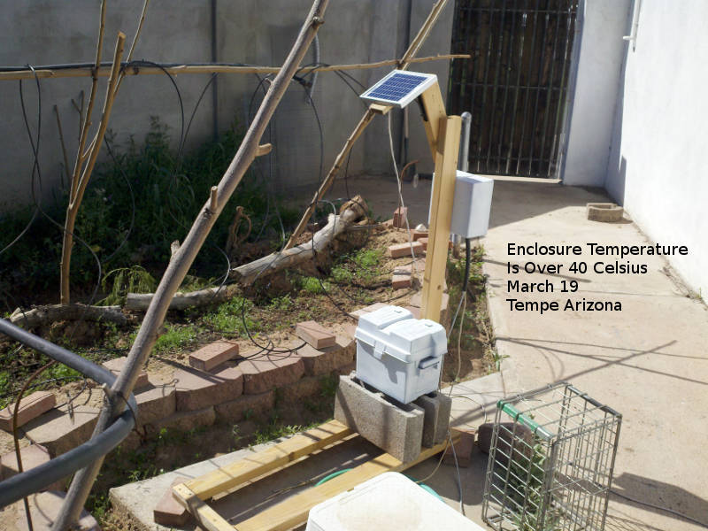
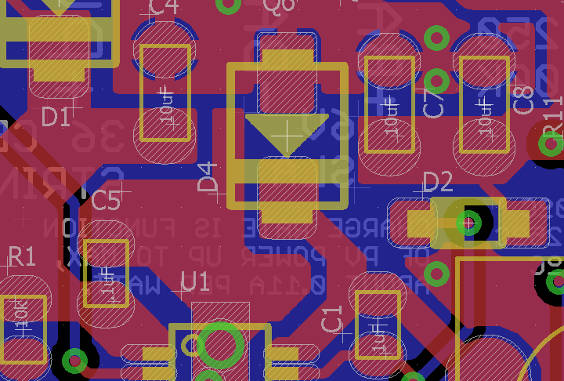
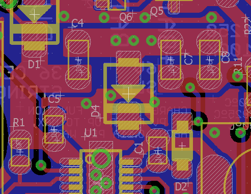
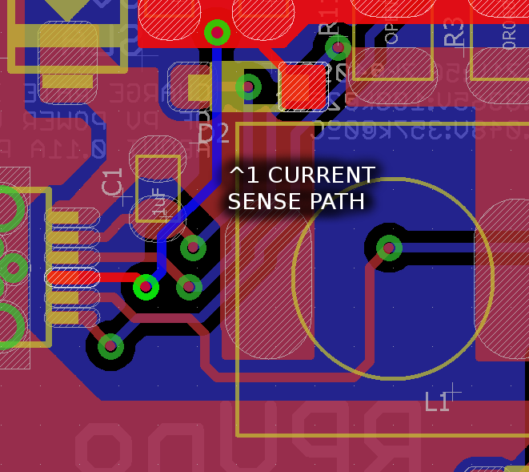
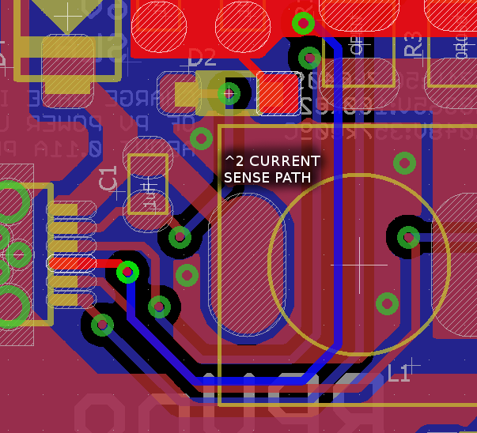

# Description

Some lessons I learned doing RPUno.

# Table Of Contents:

1. ^9 Bootloader at 38.4k bps
1. ^9 Callback's In twi.c Should Have Default
1. ^6 Solar
1. ^5 LT3652 NTC 10k
1. ^5 Baud Rate Framing Error
1. ^5 Current Source Power Off
1. ^5 ADC6 to Anode
1. ^5 ADC7 is .333 of PWR
1. ^4 Pull-down on IO2
1. ^2 Reduce EMI
1. ^1 Reduce Current Sense Noise
1. ^1 Battery Connector Polarity
1. ^0 Add Reversed Battery Protection


## ^9 Bootloader at 38.4k bps

The RPUpi^4 has a new transceiver that has a little to much delay to allow optiboot to work at 115.2k bps over a RPUBUS. This has been a known ugliness, I was not able to make the serial work with other software at that speed, but somehow avrdude and optiboot did, but now I see it was living on the edge. So I changed the bootloader and all the applications that use it.

https://github.com/epccs/RPUno/commit/b94c6fbb768734822ea4217d3d13e5bbf71325fa

Then I uploaded the bootloader and found that the EEPROM was gone. I ran the Selftest to setup the EEPROM again. Then for the next board, I have the Makefile save the EEPROM so I can recover it. So the next boards do that.

https://github.com/epccs/RPUno/commit/c95269384cfe22e797f67dceb4cef9e78d54bb28

In my mind, this is evidence that going with a Makefile rather than hacking an IDE was the right choice. How would I do this if I had used ether AS7 or Arduino's IDE? I wish Microchip would put effort into keeping the toolchain up to date and making it easy to package for Debian. I am not going to use MPLAB any more than I have AS7 so in my eyes, Microchip is wasting time on things that have little value. Besides, VScode is the new gold standard for working with source code, and every OS seems to have a subsystem (WSL) to brew (homebrew) packages.


## ^9 Callback's In twi.c Should Have Default

```
// used to initalize the Transmit functions in case they are not used.
void transmit_default(void)
{
    return;
}

typedef void (*PointerToTransmit)(void);

// used to initalize the Receive functions in case they are not used.
void receive_default(void)
{
    return;
}

typedef void (*PointerToReceive)(uint8_t*, int);

static PointerToTransmit twi_onSlaveTransmit = transmit_default;
static PointerToReceive twi_onSlaveReceive = receive_default;
```

The twi_onSlaveReceive callback looks to be run once after an I2C stop or repeated-start event is seen in the ISR. So that means the slave will get the data in a chunk and have to prep any outgoing buffer before it is needed (e.g. the twi_onSlaveTransmit callback).

twi_onSlaveTransmit and twi_onSlaveReceive are under the Arduino C++ wrappers which may ensure a default callback is set (I did not look since it does not matter for my usage). It is easy to forget to set a callback in C so adding a default is a good idea to prevent a program from trying to run code at the address of an uninitialized pointer.

https://github.com/epccs/RPUno/commit/9ebda222c3d6504993c60f48dfba18a497c539f3#diff-d9d11c95cdc55b4e98bd32bfc0204bc0


## ^7 Unused Fuse Bits Return "1" For avrdude 6.3 -c stk500v1

One of the first upload methods was stk500v1 and it returned zero for unused fuse bits, but that was backward from most other methods or what the Atmel tools show, so the Makefile needed to change when I started to use Ubuntu 17.10.

https://github.com/epccs/RPUno/commit/0715fdc9bf4d24b3f520e8fd89b0ae84b6b076a1#diff-4090823bc12f8ce382920f2970f7a371


## ^6 Solar

It turns out that a 15% power loss through the buck converter is a wash when compared to operating the PV at the battery voltage for room temperature conditions (e.g. PV MPP is 16.2V and battery is 13.8V), and at a higher temperature, losses from the buck power conversion favors a direct connection. The LT3652 is a fine chip but there needs to be a sizable voltage change from the solar panel MPP to the battery voltage for it to be beneficial.

I knew the value of the LT3652 was greatly diminished when I changed from 6V SLA to 12V SLA (^4) but I did not know that a lead-acid battery was surprisingly self-regulating durring trickle charging. Seeing this in action while running some LED's at night ([NightLight]) is what has convinced me that I needed to remove the solar charge controller from my MCU boards.

[NightLight]: https://github.com/epccs/RPUno/tree/master/NightLight

There are plenty of solar charge controllers like [SS-6L-12V] on the market, though I do have some ideas I may want to try.

[SS-6L-12V]: https://www.solar-electric.com/ss-6l.html


## ^5 LT3652 NTC 10k

It is heating up again (March 19) in Tempe Arizona. The LT3652 charge controller has an NTC temperature sensor input, which has a window from 0 to 40 Celsius with a 10k B=3380 type thermistor. I had the thermistor inside the enclosure in direct sun. The enclosure is mounted under the solar panel. Unfortunately, I am finding the window is stopping the charge and I would actually rather let the battery cook with a charge than not get a charge. 



I'm not going to provide this thermistor, cause I find it to be a pessimistic value. Time will tell how long the battery will last when it is charged above 40 Celsius, but I know it will not last long without a charge. The LT3652 has a 50uA current source on the NTC pin and the voltage that develops is used by a few comparators (similar to how the TPS3700 works).

Back in early February, there were some warm days and I found the charger had stopped after having worked most of the day. The night before I had put an equalizing charge on the battery. I thought the 15V from equalizing had damaged the LT3652, but it worked fine when I got it to the bench. So now I think it had got too hot and the NTC pin turned it off.


## ^5 Baud Rate Framing Error

At 115.2k [Bit Rate] there is a large framing error (2.1%). I have seen enough errors now to be convinced that I need to use a bit rate that has less framing error. Looking at the [Rate Calculator] I see 76.8k is very good (0.2%), but the picocom packaged on Ubuntu does not support it. The next very good rate is 38.4k (also 0.2%) which picocom does support. The bootloader does a CRC check with each line in the hex file so running it at 115.2k is ok, it will redo the chunks with errors. However, I don't want to see any errors while running commands (that would look bad during a demo).

[Bit Rate]: https://en.wikipedia.org/wiki/Bit_rate#Gross_bit_rate
[Rate Calculator]: http://wormfood.net/avrbaudcalc.php

Turns out the ideal bit rate to use is 125k or 250k which has 0% error. I am using slew limited 250k RS485 transceivers so that is the max. The released version of picocom does not support custom bit rates. The good news is that picocom custom rates were fixed. All I have to do is wait for the next release after [picocom_2.2] and then Debian needs to pick it up but Debian is still using 1.7 from google code (what a PITA).

Note: [Baud] is the wrong term, but is the one everyone knows.

[Baud]: https://en.wikipedia.org/wiki/Baud
[picocom 2.2]: https://github.com/npat-efault/picocom/releases

It may be helpful to understand that the start and stop bits make up the framing system, and having little idle time between transmissions may help push the system into less stable operation.  I think this is why I was seeing errors when I cut-and-paste into picocom at 115.2k, there were never errors when typing directly or when only a few characters were paste.


## ^5 Current Source Power Off

Presently IO9 can turn off the flow meter current source (which was verified to work), but it might as well turn off all current sources in the next revision. That would allow the choice to cut data acquisition in order to preserve some level of operation.


## ^5 ADC6 to Anode

Measure PV_IN from the anode of battery discharge blocking diode. After changing the battery voltage to 12V the cathode side only goes down to about 6.5V. It is useful to see the dark voltage, which might give clues about the moon's cycle.


## ^5 ADC7 is .333 of PWR

PWR node can go to 14V so swap 200k on R37 to R36 and swap the 100k on R36 to R37. Version ^4 changed from 6V to 12V SLA but I never looked at ADC7.


## ^4 Pull-down on IO2

When the ATMega328p starts its pins are in high-z mode (/w ESD diode clamps to VCC and 0V). So the gate on Q19 can float near its threshold voltage, which is what I am seeing with this first board, so I added a pull-down. 
    
Note: The RPUadpt should get power from +5V and on the RPUpi the VIN power should be used to power only the SBC. The RPUftdi can apply its USB power to the +5V line, in which case on the RPUno the VIN line gets back driven to about 4.8V and the pluggable IO is ESD protected (clamped) to that level (which seems fine). 


## ^2 Reduce EMI

While working on Irrigat7 I realized that as the current in the buck converter diode (D4) switches off and the current flow that feeds the inductor swaps over to the input capacitor (C4) it will cause magnetic fields that drive the changing current flow to the outside edge of the trace or plane. The fast changing current builds a magnetic bubble that expands as current eddies block the magnetic flux in the conductive trace or plane, which drive the current flow to the outermost edge. Put another way the cascading magnetic fields and current loops push rapidly changing current flow right to the edge of the copper, and if that copper happens to be the ground plane then that is bad news. The rapidly changing current flow on the 0V node needs to happen on a small island (copper pour) to confine, localize and minimize the EMI. The small island should be connected to the main 0V plane in a way that is not seen as an edge for the fields to push the rapidly changing current flow onto. I used some via  in the center of a copper islands (e.g. a copper pour) that connects the 0V side of C4, D4, C7, and C8. Now the fast changing current flow can happen on the island edges and not get pushed onto the main 0V plane.




It would also be helpful to minimize the switched current path, but heat spreading is more important in this case.


## ^1 Reduce Current Sense Noise

Current sense noise is disrupting float charge cycle.

The LT3652 pin 12 is switching between the PV voltage and a diode drop bellow ground. That could be capacitivly coupling to the current sense line, but what I think is causing the problem is magnetic fields from fast changing current flows in D4, U1 pin 12 and perhaps even C1 induces voltage in the current sense path. I need to get the current sense path away from that stuff and use ground planes to shield it. 
    



Disrupting the charge cycle, as ^1 did, will also damage the battery, so the board was scraped (execpt a few parts).

Testing shows this change worked, the current limit shifted from 0.86A (^1) to 1.32A (^2). I salvaged the LT3652 chip from the first board so it was the same device. The float charge timing is now working correctly as well.


## ^1 Battery Connector Polarity

Polarity does not match CC01 connector, it should match.


## ^0 Add Reversed Battery Protection

Push updates from another board (CC01^4) to this board, I did not build a RPUno^0 board. 

