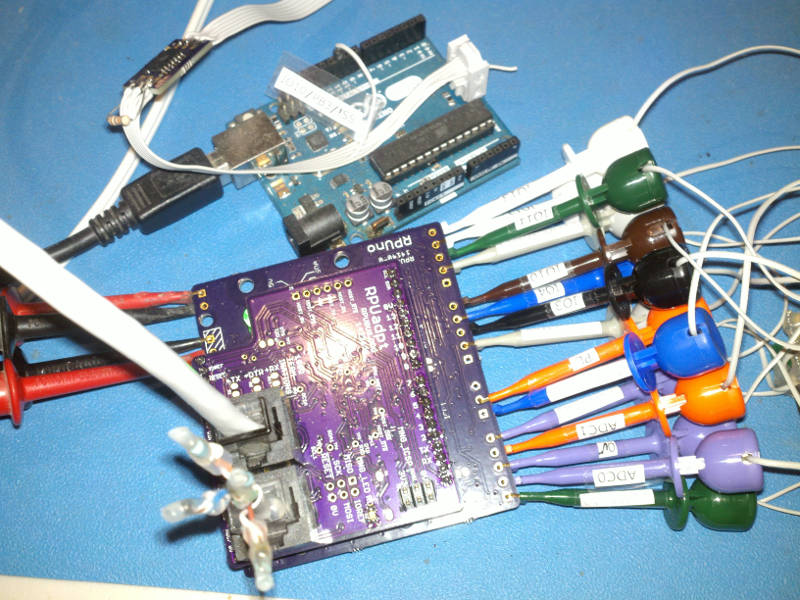

# Description

This is a list of Test preformed on each RPUno after assembly.

# Table of References


# Table Of Contents:

1. [Basics](#basics)
2. [Assembly check](#assembly-check)
3. [IC Solder Test](#ic-solder-test)
6. [Power Protection](#power-protection)
7. [Power Without SMPS](#power-without-smps)
8. [Bias +5V](#bias-5v)
9. [Set MCU Fuse and Install Bootloader](#set-mcu-fuse-and-install-bootloader)
10. [Install SMPS](install-smps)
11. [Self Test](#self-test)


## Basics

These tests are for an assembled RPUno board 14140^9 which may be referred to as a Unit Under Test (UUT). If the UUT fails and can be reworked then do so, otherwise it needs to be scraped. 

**Warning: never use a soldering iron to rework ceramic capacitors due to the thermal shock.**
    
Items used for test.




## Assembly check

After assembly check the circuit carefully to make sure all parts are soldered and correct. The device marking is labeled on the schematic and assembly drawing.
    
NOTE: U2 is not yet on the board, so +5V will not have power.


## IC Solder Test

U2 is not yet populated. Check that a diode drop to 0V is present from a circuit board pad that is connected to each of the pins of U1, and U3 by measuring with a DMM's diode test set up for reversed polarity. Consult the schematic to determine which pins can be skipped (e.g. ground, power rail, ...).

This is a simplified In-Circuit Test (ICT). It could become more valuable if the node voltage driven with the current source is recorded for each tested location and then used with statistics to determine test limits for each location. 


## Power Protection

Apply a current limited (20mA) supply set with 5V to the PWR and 0V connector J7 in reverse and verify that the voltage does not get through. Adjust the supply to 36V and verify no current is passing.


## Power Without SMPS

Apply a current limited (20mA) supply set with 7V to the PWR and 0V connector J7 and verify that the voltage does get through. Adjust the supply so the LED is on and stable and measure voltage, adjust supply to 30V measure input current. 

NOTE for referance the zener voltage on Q6 is 7.75V at 30V.

```
{ "LEDON_V":[10.7,10.7,10.8,10.7,10.7,10.7,10.7,10.7,],
  "PWR@7V_mA":[0.3,0.07,0.08,0.07,0.07,0.07,0.07,0.07,],
  "PWR@30V_mA":[2.6,1.4,1.3,1.3,1.3,1.3,1.3,1.3,]}
```


## Bias +5V

Apply a 30mA current limited 5V source to +5V (J7). Check that the input current is for a blank MCU (e.g. less than 7mA). Turn off the power.

```
{ "I_IN_BLANKMCU_mA":[4.7,2.2,3.1,3.5,3.3,2.3,2.5,2.1,]}
```

Note: Internal clock/8 (=1MHz) and IO pins are floating (a test fixture is needed).


## Set MCU Fuse and Install Bootloader

Install Git and AVR toolchain on Ubuntu (18.04, on an old computer try https://wiki.ubuntu.com/Lubuntu). 

```
sudo apt-get install git gcc-avr binutils-avr gdb-avr avr-libc avrdude
```

Clone the RPUno repository.

```
cd ~
git clone https://github.com/epccs/RPUno
cd ~/RPUno/Bootloader
```

Connect a 5V supply with CC mode set at 30mA to +5V (J7). Connect the ISP tool (J11). The MCU needs its fuses set, so run the Makefile rule to do that. 

```
make fuse
```

Next install the bootloader

```
make isp
```

Disconnect the ICSP tool and measure the input current, wait for the power to be settled. Turn off the power.

```
{ "I_IN_16MHZ_EXT_CRYST_mA":[12.7,11.2,11.1,11.0,11.0,10.8,10.6,10.7,]}
```

Add U2 to the board now. Measurement of the input current is for referance (takes a long time to settle, 10mA ICP1 jumper is off).


## Install SMPS

Install U2 and measure its output voltage and input current with the supply set at 12.8V and a 30mA current limit.

```
{ "+5V_V":[4.94,5.00,5.00,5.01,4.9760,4.9900,49595]}
```


## Self Test

Plug an [RPUftdi] shield with [Host2Remote] firmware onto an [RPUno] board (not the UUT but a separate board) and load [I2C-Debug] on it.

[RPUftdi]: https://github.com/epccs/RPUftdi
[Host2Remote]: https://github.com/epccs/RPUftdi/tree/master/Host2Remote
[RPUno]: https://github.com/epccs/RPUno
[I2C-Debug]: https://github.com/epccs/RPUno/tree/master/i2c-debug

Use picocom to set the bootload address on the RPUftdi shield. The RPUftdi is at address 0x30 and the UUT will be at address 0x31.

```
picocom -b 38400 /dev/ttyUSB0
...
Terminal ready
/0/iaddr 41
{"address":"0x29"}
/0/ibuff 3,49
{"txBuffer":[{"data":"0x3"},{"data":"0x31"}]}
/0/iread? 2
{"rxBuffer":[{"data":"0x3"},{"data":"0x31"}]}
```
Exit picocom (Cntl^a and Cntl^x). Plug an [RPUadpt] shield with [Remote] firmware onto the UUT board. Note the RPUadpt address defaults to 0x31 when its firmware was installed.

[RPUadpt]: https://github.com/epccs/RPUadpt
[Remote]: https://github.com/epccs/RPUadpt/tree/master/Remote

Connect the Self Test [Harness] to the UUT. Connect a 12.8V supply with CC set at 150mA.

[Harness]: https://raw.githubusercontent.com/epccs/RPUno/master/SelfTest/Setup/SelfTestWiring.png

Once the UUT has power check that the VIN pin on the shield has power (this is not tested by the self-test so it has to be done manually).

Measure the +5V supply at J7 pin 4.

Edit the SelfTest main.c such that "#define REF_EXTERN_AVCC 5008600UL" has the correct value. Next, run the bootload rule in the Makefile to upload the self-test firmware to the UUT that the remote shield is mounted on.

```
cd ~RPUno/SelfTest
gedit main.c
make bootload
# toss the change if you want
git checkout -- main.c
```

Use picocom to see the SelfTest results on its serial interface.


```
picocom -b 38400 /dev/ttyUSB0
picocom v1.7
...
Terminal ready
RPUno Self Test date: Apr 23 2018
avr-gcc --version: 5.4.0
I2C provided address 0x31 from RPUadpt serial bus manager
adc reading for PWR_V: 355
PWR at: 12.722 V
ADC0 R1 /W all CS off: 0.000 V
ADC1 at ICP1 TERM /w all CS off: 0.000 V
ADC2 at GN LED /w DIO13 sinking and all CS off: 0.000 V
ADC3 at YE LED /w DIO10 sinking and all CS off: 0.000 V
ICP1 input should be HIGH with 0mA loop current: 1 
CS0 on R1: 0.022 A
DIO11 shunting CS0: 0.014 A
CS1 source on R1: 0.022 A
   ADC0 reading used to calculate ref_intern_1v1_uV: 689 A
   calculated ref_intern_1v1_uV: 1082791 uV
REF_EXTERN_AVCC old value found in eeprom: 5007000 uV
REF_INTERN_1V1 old value found in eeprom: 1082204 uV
REF_EXTERN_AVCC from eeprom is same
PWR_I at no load use INTERNAL_1V1: 0.012 A
CS2 source on R1: 0.022 A
Yellow LED D4 fwd /w CS2 V: 2.112 V
DIO10 shunting CS2: 0.015 A
CS3 source on R1: 0.022 A
DIO12 shunting CS3: 0.015 A
CS_ICP1 in UUT PL input: 0.018 A
Green LED D1 fwd /w CS_ICP1 V: 2.147 V
ICP1 /w 17mA on termination reads: 0 
DIO13 shunting CS_ICP1: 0.015 A
[PASS]
```

Before truning off the power check that the VIN pin for the shield has no power, the test turns it off. Then turn off the power supply.
