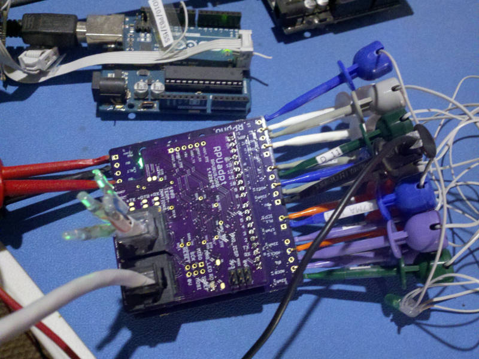

# Description

This is a list of Test preformed on each RPUno after assembly.

# Table of References


# Table Of Contents:

1. [Basics](#basics)
2. [Assembly check](#assembly-check)
3. [IC Solder Test](#ic-solder-test)
6. [Power Protection](#power-protection)
7. [Power Without SMPS](#power-without-smps)
8. [Bias +5V](#bias-5v)
9. [Set MCU Fuse and Install Bootloader](#set-mcu-fuse-and-install-bootloader)
10. [Install SMPS](install-smps)
11. [Self Test](#self-test)


## Basics

These tests are for an assembled RPUno board 14140^6 which may be referred to as a Unit Under Test (UUT). If the UUT fails and can be reworked then do so, otherwise it needs to be scraped. 

**Warning: never use a soldering iron to rework ceramic capacitors due to the thermal shock.**
    
Items used for test.




## Assembly check

After assembly check the circuit carefully to make sure all parts are soldered and correct, note that the device making is labeled on the schematic and assembly drawing.
    
NOTE: U2 is not yet on the board, so +5V will not have power.


## IC Solder Test

Check that a diode drop is present from each pin to 0V by measuring with a DMM's diode test between each pin and the 0V plane (reversed polarity). U1 pins 12, 10 and 9 are connected to L1 and R3 and read with a low (.13V) value. U2 not pop yet. U1 diode value on pins 1,3,4, and 5, pins 3 and 4 shorted through R4. U3 pin 3, 5, 21 are connectd to the 0V plane and should have a short.


## Power Protection

Apply a current limited (20mA) supply set with 5V to the PWR and 0V connector J8 in reverse and verify that the voltage does not get through. Adjust the supply to 36V and verify no current is passing.


## Power Without SMPS

Apply a current limited (20mA) supply set with 7V to the PWR and 0V connector J8 and verify that the voltage does get through. Adjust the supply so the LED is on and stable and measure voltage, adjust supply to 30V measure input current. 

NOTE the zener voltage on Q3 is for referance and will change with each unit.

```
{ "LEDON_V":[10.7,],
  "PWR@7V_mA":[0.3,],
  "PWR@30V_mA":[2.6,],
  "Q3ZEN@30V_V":[7.75,]}
```


## Bias +5V

Apply a 30mA current limited 5V source to +5V (J7). Check that the input current is for a blank MCU (e.g. less than 6mA). Turn off the power.

```
{ "I_IN_BLANKMCU_mA":[4.7,]}
```


## Set MCU Fuse and Install Bootloader

Install Git and AVR toolchain on Ubuntu (16.04, on an old computer try https://wiki.ubuntu.com/Lubuntu). 

```
sudo apt-get install git gcc-avr binutils-avr gdb-avr avr-libc avrdude
```

Clone the RPUno repository.

```
cd ~
git clone https://github.com/epccs/RPUno
cd ~/RPUno/Bootloader
```

Connect a 5V supply with CC mode set at 30mA to +5V (J7). Connect the ICSP tool (J11). The MCU needs its fuses set, so run the Makefile rule to do that. 

```
make fuse
```

Next install the bootloader

```
make isp
```

Disconnect the ICSP tool and measure the input current, wait for the power to be settled. Turn off the power.

```
{ "I_IN_16MHZ_EXT_CRYST_mA":[12.7,]}
```

Add U2 to the board now. Measurement of the input current is for referance (takes a long time to settle, 10mA ICP1 jumper is off).


## Install SMPS

Install U2 and measure its output voltage and input current with the supply set at 12.8V and a 30mA current limit. Measure recover voltage after dropout (e.g. PWR voltage at which +5V recovers after droping).

```
{ "+5V_V":[4.94,],
  "PWR12V8_mA":[9.00,],
  "PWR-DR_V":[6.2,]}
```


## Self Test

Plug an [RPUftdi] shield with [Host2Remote] firmware onto an [RPUno] board (not the UUT but a separate board) and load [I2C-Debug] on it.

[RPUftdi]: https://github.com/epccs/RPUftdi
[Host2Remote]: https://github.com/epccs/RPUftdi/tree/master/Host2Remote
[RPUno]: https://github.com/epccs/RPUno
[I2C-Debug]: https://github.com/epccs/RPUno/tree/master/i2c-debug

Use picocom to set the bootload address on the RPUftdi shield. The RPUftdi is at address 0x30 and the UUT will be at address 0x31.

```
picocom -b 38400 /dev/ttyUSB0
...
Terminal ready
/0/address 41
{"address":"0x29"}
/0/buffer 3,49
{"txBuffer":[{"data":"0x3"},{"data":"0x31"}]}
/0/read? 2
{"rxBuffer":[{"data":"0x3"},{"data":"0x31"}]}
```
Exit picocom (Cntl^a and Cntl^x). Plug an [RPUadpt] shield with [Remote] firmware onto the UUT board. Note the RPUadpt address defaults to 0x31 when its firmware was installed.

[RPUadpt]: https://github.com/epccs/RPUadpt
[Remote]: https://github.com/epccs/RPUadpt/tree/master/Remote

Connect ICP1 (J8) jumper. Connect the Self Test [Harness] to the UUT. Connect 100 kOhm resistor to both the PV side and BAT side thermistor inputs to simulate room temperature. Connect a 12V SLA battery to the +BAT and -BAT. Connect +PV and -PV to a CC/CV mode supply with CC set at 150mA and  CV set at 0V. Apply power and increase the CV setting to 21V.

[Harness]: https://raw.githubusercontent.com/epccs/RPUno/master/SelfTest/Setup/SelfTestWiring.png

Once the UUT connects power (battery charged to > 13.1V) check that the VIN pin on the shield has power (this is not tested by the self-test so it has to be done manually).

Measure the +5V supply at J7 pin 6 and pin 5.

```
{ "+5V":[5.00,4.99,4.95,4.96,5.00,4.99,4.97,5.00,] }
```

Edit the SelfTest main.c such that "#define ADC_REF 5.0" has the correct value for the UUT. Next, run the bootload rule in the Makefile to upload the self-test firmware to the UUT that the remote shield is mounted on.

```
cd ~RPUno/SelfTest
gedit main.c
make bootload
# toss the change
git checkout -- main.c
```

Use picocom to see the SelfTest results over its UART interface.


```
picocom -b 38400 /dev/ttyUSB0
picocom v1.7
...
Terminal ready
Self Test date: Feb 18 2017
I2C provided address 0x31 from RPU bus manager
+5V needs measured and then set as ADC_REF: 4.950 V
Charging with CURR_SOUR_EN==off: 0.108 A
PWR (Battery) at: 13.385 V
MPPT at: 16.999 V
ADC0 at: 0.000 V
ADC1 at: 0.000 V
ICP1 /w 0mA on plug termination reads: 1
CC_nFAULT measured with a weak pull-up: 1
Charging delta with CURR_SOUR_EN==on: 0.087 A
ADC0 with its own 20mA source on R1: 0.022 A
ADC1 with ICP1's 10mA on ICP1_TERM: 0.010 A
ICP1 /w 10mA on plug termination reads: 0
Dischrging at: 0.101 A
PV open circuit (LT3652 off) at: 21.242 V
ADC0 and digital curr source on R1: 0.044 A
ADC0 measure curr on R1 with DIO12 shunting: 0.028 A
ADC0 measure curr on R1 with DIO13 shunting: 0.028 A
ADC0 and ADC1 curr source on R1: 0.044 A
ADC0 measure curr on R1 with DIO10 shunting: 0.028 A
ADC0 measure curr on R1 with DIO11 shunting: 0.028 A
ICP1 10mA + 16mA curr source on ICP1_TERM: 0.028 A
ICP1 curr on ICP1_TERM with DIO4 shunting: 0.013 A
ICP1 curr on ICP1_TERM with DIO3 shunting: 0.013 A
To disconnect battery turn off the PV supply and LED should stop blinking
[PASS]
```

Before truning off the PV power check that the VIN pin on the shield has no power, the test turns it off. Then turn off the power supply and verify battery was disconnected.
