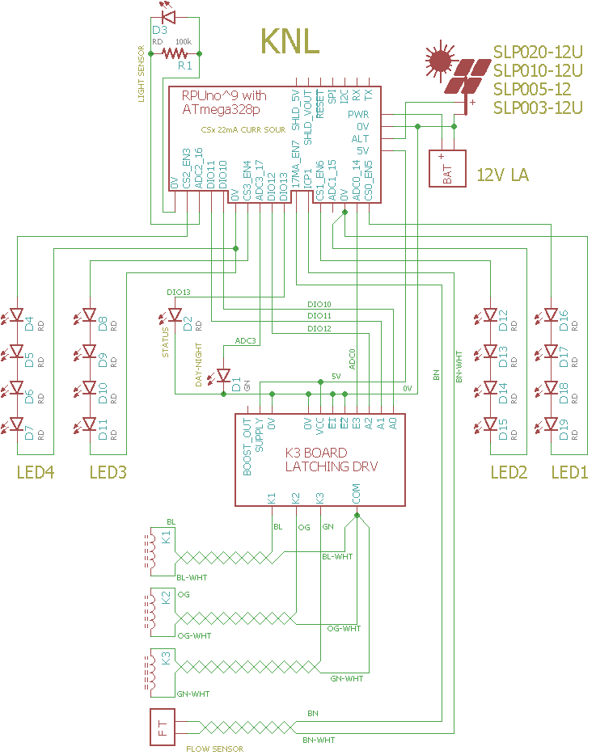

# Solenoid and Night Light combined

__Warning__ This program may be to big, and not fit, check for [Irrigate7] updates or shake the tree with a GitHub issue to.

[Irrigate7]: 

## known bugs

If the sun is up after an MCU reset or power up then alternate power is not enabled until the next day. The workaround is to cover light sensor during reset or power up.


## Overview

See [Solenoid] and [NightLight].

This hulking mess needs to trim down.


## Wiring K3 to RPUno

``` 
ATmega328p RPUno       K3      function
-----------------------------------------
PC0        DIO14       E3      74HC238 ENABLE 
PC3        DIO17       na      DAY-NIGHT STATUS LED
0V         na          nE2
0V         na          nE1
PB2        DIO10       A0      74HC238 ADDRESS 0
PB3        DIO11       A1      74HC238 ADDRESS 1
PB4        DIO12       A2      74HC238 ADDRESS 2
PB5        DIO13       na      STATUS LED
PC2        ADC2        na      LIGHT SENSOR
PB0        ICP1        na      FLOW SENSOR
PD7        CS_ICP1_EN  na      CURR SOUR
PD5        CS0_EN      na      LED STRING 1
PD6        CS1_EN      na      LED STRING 2
PD3        CS2_EN      na      LED STRING 3
PD4        CS3_EN      na      LED STRING 4
``` 




The STATUS_LED blinks on and off for a second when an rpu_address is read over I2C (if I2C failed it blinks four times as fast). 


# EEPROM Memory map 

A map of the solenoid settings in EEPROM. 

```
function            type    ee_addr:K1  K2  K3
id                  UINT16          40  60  80
delay_start_sec     UINT32          42  62  82
runtime_sec         UINT32          46  66  86
delay_sec           UINT32          50  70  90
flow_stop           UINT32          54  74  94
cycles              UINT8           58  78  98
```

A map of the LED timer settings in EEPROM. 

```
function            type    ee_addr:L1   L2   L3   L4
id                  UINT16          200  220  240  260
delay_start_sec     UINT32          202  222  242  262
runtime_sec         UINT32          206  226  246  266
delay_sec           UINT32          210  230  250  270
mahr_stop           UINT32          214  234  254  274
cycles              UINT16          218  238  258  278
```


# Start of Day 

The [day-night] state machine is used to load and run [Solenoid] EEPROM values after the morning debounce. The valves will start to cycle after the delay_start time has elapsed each morning.

[day-night]: ../DayNight
[Solenoid]: ../Solenoid

# Start of Night

The [day-night] state machine is used to load and run [NightLight] LED EEPROM values after the evening debounce. The LED timers work like the Solenoid timers except mAHr_stop replaces flow_stop (it will stop the LED once that much current has been used from the battery). Also, the LED's do not have a resource constraint (i.e. the Flow Meter), so all the LED's can operate at once.

[NightLight]: ../NightLight


# Flow Sensor

ICP1 is available through the [Capture][../Capture] commands. The differance in capture counts (between valve start and stop time) is held as the flow data for each zone and its value is can be reported with the /flow? command.


# Firmware Upload

With a serial port connection (set the BOOT_PORT in Makefile) and optiboot installed on the RPUno run 'make bootload' and it should compile and then flash the MCU.

``` 
sudo apt-get install git gcc-avr binutils-avr gdb-avr avr-libc avrdude
git clone https://github.com/epccs/RPUno/
cd /RPUno/KNL
make bootload
...
Program:   32050 bytes (97.8% Full)
(.text + .data + .bootloader)

Data:       1127 bytes (55.0% Full)
(.data + .bss + .noinit)
...
avrdude done.  Thank you.
``` 

__Warning__ verify that the size is less than 98% the bootloader takes about 2%.

Now connect with picocom (or ilk).

``` 
#exit is C-a, C-x
picocom -b 38400 /dev/ttyUSB0
``` 


# Commands

Commands are interactive over the serial interface at 38400 baud rate. The echo will start after the second character of a new line. 


## /\[rpu_address\]/\[command \[arg\]\]

rpu_address is taken from the I2C address 0x29 (e.g. ../Uart/id.h get_Rpu_address() ). The value of rpu_address is used as a character in a string, which means don't use a null value (C strings are null terminated), but the ASCII value for '1' (0x31) is easy and looks nice, though I fear it will cause some confusion when it is discovered that the actual address value is 49.

The STATUS_LED is bliked fast (twice per second) if the I2C address is not found, also the rpu_address defaults to '0'. 

Commands and their arguments follow.


## /0/id? \[name|desc|avr-gcc\]

Identify is from ../Uart/id.h Id().

``` 
/1/id?
{"id":{"name":"KNL","desc":"RPUno (14140^9) Board /w atmega328p","avr-gcc":"5.4.0"}}
```


## [/0/krun k\[,cycles\]](../Solenoid#0krunkcycles)  


## [/0/ksave k,cycles](../Solenoid#0ksavekcycles) 


## [/0/kload k](../Solenoid#0kloadk) 


## [/0/kstop k](../Solenoid#0kstopk) 


## [/0/kpre k,delay_start_in_sec](../Solenoid#0kprekdelaystartinsec)


## [/0/krunt k,runtime_in_sec](../Solenoid#0kruntkruntimeinsec)


## [/0/kdelay k,delay_in_sec](../Solenoid#0kdelaykdelayinsec)


## [/0/kfstop k,flow_stop](../Solenoid#0kfstopkflowstop)


## [/0/kflow? k](../Solenoid#0kflowk)


## [/0/ktime? k](../Solenoid#0ktimek)


## [/0/runled led\[,cycles\]](../NightLight#0runledledcycles) 


## [/0/stopled led](../NightLight#0stopledled)


## [/0/preled led,delay_start_in_sec](../NightLight#0preledleddelaystartinsec)


## [/0/runtimeled led,runtime_in_sec](../NightLight#0runtimeledledruntimeinsec)


## [/0/delayled led,delay_in_sec](../NightLight#0delayledleddelayinsec)


## [/0/mahrled led,mAHr](../NightLight#0mahrledledmahr)


## [/0/savled led,cycles](../NightLight#0saveledledcycles)


## [/0/loadled led](../NightLight#0loadledled)


## [/0/led? led](../NightLight#0ledled)


## [/0/analog? 0..7\[,0..7\[,0..7\[,0..7\[,0..7\]\]\]\]](../Adc#0analog-0707070707)


## [/0/iscan?](../i2c-debug#0iscan)


## [/0/iaddr 0..127](../i2c-debug#0iaddr-0127)


## [/0/ibuff 0..255\[,0..255\[,0..255\[,0..255\[,0..255\]\]\]\]](../i2c-debug#0ibuff-02550255025502550255)


## [/0/ibuff?](../i2c-debug#0ibuff)


## [/0/iwrite](../i2c-debug#0iwrite)


## [/0/iread?](../i2c-debug#0iread)


## [/0/day?](../DayNight#0day)


## [/0/charge?](../AmpHr#0charge)


## [/0/alt](../Alternat#0alt)


## [/0/altcnt?](../Alternat#0altcnt)


