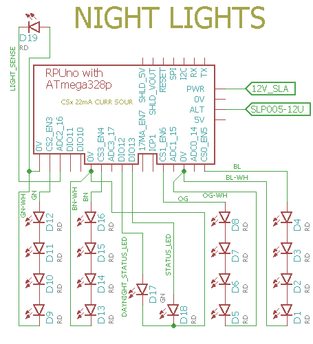

# Night Light

## Overview

RPUno has some current sources that can be used to light LED strings. CS0..CS3 are 22mA souces. Digital 13 is used for I2C status, and Digital 12 is used for Day-Night status. 

Night light uses non-blocking timers to cycles through the led[1|2|3|4].cycle_state that is used to control the current sources. The settings are loaded from EEPROM each night with a callback that is given to DayNight's  Night_AttachWork callback registration function.

Note: There is no way to check the solar charge gain. the Day_AttachWork() function is given a callback that is used to reset the accumulation values.


# Wiring LED Strings to RPUno




The current sources drop a little over a diode voltage bellow the battery voltage, so the LED string needs to conduct at less than that (four red conduct at about 9V, five at 11.3V). 


# EEPROM Memory map 

A map of the LED timer settings in EEPROM. 

```
function            type    ee_addr:L1   L2   L3   L4
id                  UINT16          200  220  240  260
delay_start_sec     UINT32          202  222  242  262
runtime_sec         UINT32          206  226  246  266
delay_sec           UINT32          210  230  250  270
mahr_stop           UINT32          214  234  254  274
cycles              UINT16          218  238  258  278
```

This works like [Solenoid] except the mAHr_stop replaces flow_stop, it will stop the LED once that much current has been used from the battery. Also, the LED's do not have a resource constraint (i.e. the Flow Meter), so all the LED's can be used at once.

[Solenoid]: ../Solenoid

# Firmware Upload

With a serial port connection (set the BOOT_PORT in Makefile) and optiboot installed on the RPUno run 'make bootload' and it should compile and then flash the MCU.

``` 
rsutherland@conversion:~/Samba/RPUno/NightLight$ make bootload
...
avrdude done.  Thank you.
``` 

Now connect with picocom (or ilk). Note I am often at another computer doing this through SSH. The Samba folder is for editing the files from Windows.

``` 
#exit is C-a, C-x
picocom -b 38400 /dev/ttyUSB0
``` 


# Commands

Commands are interactive over the serial interface at 38400 baud rate. The echo will start after the second character of a new line. 

## /\[rpu_address\]/\[command \[arg\]\]

rpu_address is taken from the I2C address 0x29 (e.g. ../Uart/id.h get_Rpu_address() ). The value of rpu_address is used as a character in a string, which means don't use a null value (C strings are null terminated), but the ASCII value for '1' (0x31) is easy and looks nice, though I fear it will cause some confusion when it is discovered that the actual address value is 49.

The STATUS_LED is bliked fast (twice per second) if the I2C address is not found, also the rpu_address defaults to '0'. 

Commands and their arguments follow.


## /0/id? \[name|desc|avr-gcc\]

Identify is from ../Uart/id.h Id().

``` 
/1/id?
{"id":{"name":"NightLight","desc":"RPUno Board /w atmega328p and LT3652","avr-gcc":"4.9"}}
```

##  /0/runled led\[,cycles\] 

Start the led (1|2|3|4) operation, with option to override cycles (1..65635). 

If EEPROM settings have not been loaded the LED's retain the initialized values (delay_start = 1+(3*led), runtime = 1, delay = 3600, mahr_stop = MAHR_NOT_SET) that will cause each led to operate for a second after a delay_start time that spaces there operation out by 3 seconds each (it helps to test the setup).

After a led has entered the delay state and let go of the mAHr meter resource another solenoid that is ready to use the meter will do so. Make sure to set the delay time long enough that all the other LED's can use their runtime, or the meter becomes a resource constraint and some will get shorted. For example set all the delay times to 360 and make sure the combined runtimes do not add up to 360 (i.e. 100, 80, 120).

```
/1/runled 1,5000
{"LED1":{"delay_start_sec":"1","runtime_sec":"1","delay_sec":"13","cycles":"5000"}}
/1/runled 2,5000
{"LED1":{"delay_start_sec":"1","runtime_sec":"1","delay_sec":"13","cycles":"5000"}}
/1/runled 3,5000
{"LED1":{"delay_start_sec":"1","runtime_sec":"1","delay_sec":"13","cycles":"5000"}}
/1/runled 4,5000
{"LED1":{"delay_start_sec":"1","runtime_sec":"1","delay_sec":"13","cycles":"5000"}}
```

##  /0/savled led,cycles 

Save the led (1|2|3|4) with cycles (1..65635) to EEPROM. A callback function is used to attach the callback_for_night_attach routine that loads these values at the start of the night (i.e. Night_AttachWork).

```
/1/saveled 1,5000
{"LED1":{"delay_start_sec":"1","runtime_sec":"4","delay_sec":"2","mahr_stop":"400","cycles":"5000"}}
/1/saveled 2,5000
{"LED2":{"delay_start_sec":"3","runtime_sec":"5","delay_sec":"2","mahr_stop":"600","cycles":"5000"}}
/1/saveled 3,5000
{"LED3":{"delay_start_sec":"5","runtime_sec":"4","delay_sec":"2","mahr_stop":"800","cycles":"5000"}}
/1/saveled 4,5000
{"LED4":{"delay_start_sec":"7","runtime_sec":"5","delay_sec":"2","mahr_stop":"1000","cycles":"5000"}}
```

##  /0/loadled led

Load the led (1|2|3|4) from EEPROM. Use run to start it.

```
/1/loadled 1
{"LED1":{"delay_start_sec":"1","runtime_sec":"4","delay_sec":"2","mahr_stop":"400","cycles":"5000"}}
/1/loadled 2
{"LED2":{"delay_start_sec":"3","runtime_sec":"5","delay_sec":"2","mahr_stop":"600","cycles":"5000"}}
/1/loadled 3
{"LED3":{"delay_start_sec":"5","runtime_sec":"4","delay_sec":"2","mahr_stop":"800","cycles":"5000"}}
/1/loadled 4
{"LED4":{"delay_start_sec":"7","runtime_sec":"5","delay_sec":"2","mahr_stop":"1000","cycles":"5000"}}
```


##  /0/stopled led

Stop a running LED, reduce the delay_start, runtime, and delay to one second each to finish the led (1|2|3|4) operation without mixing up the state machine.

To change an led setting use /stop, then /load, and change the desired setting (e.g. /runtime) and finally save it and perhaps /run it.

```
/1/stopled 1
{"LED1":{"delay_start_sec":"1","runtime_sec":"1","delay_sec":"1","cycles":"1"}}
```


##  /0/preled led,delay_start_in_sec

Set the led (1|2|3|4) one time delay befor cycles run (1..21600, e.g. 6hr max). 

``` 
/1/preled 1,1
{"LED1":{"delay_start_sec":"1"}}
/1/preled 2,3
{"LED2":{"delay_start_sec":"3"}}
/1/preled 3,5
{"LED3":{"delay_start_sec":"5"}}
/1/preled 4,7
{"LED4":{"delay_start_sec":"7"}}
/1/runled 2,1
{"LED2":{"delay_start_sec":"3","runtime_sec":"1","delay_sec":"13","cycles":"1"}}
``` 


##  /0/runtimeled led,runtime_in_sec

Set the led (1|2|3|4) run time (1..21600, e.g. 6hr max). 

``` 
/1/runtimeled 1,4
{"LED1":{"runtime_sec":"4"}}
/1/runtimeled 2,5
{"LED2":{"runtime_sec":"5"}}
/1/runtimeled 3,4
{"LED3":{"runtime_sec":"4"}}
/1/runtimeled 4,5
{"LED4":{"runtime_sec":"5"}}
/1/runled 1,1
{"LED1":{"delay_start_sec":"1","runtime_sec":"4","delay_sec":"13","cycles":"1"}}
```


##  /0/delayled led,delay_in_sec

Set the led (1|2|3|4) delay between runs (1..86400, e.g. 24 hr max). 

```
/1/delayled 1,2
{"LED1":{"delay_sec":"2"}}
/1/delayled 2,2
{"LED2":{"delay_sec":"2"}}
/1/delayled 3,2
{"LED3":{"delay_sec":"2"}}
/1/delayled 4,2
{"LED4":{"delay_sec":"2"}}
/1/runled 3,1
{"LED3":{"delay_start_sec":"5","runtime_sec":"4","delay_sec":"2","cycles":"1"}}
```

##  /0/mahrled led,mAHr

Set the led (1|2|3|4) max discharge in mAHr (1..86400, e.g. 86.4AHr). When the battery has discharged by this amount the LED will stop.

```
/1/mahrled 1,400
{"LED1":{"mahr_stop":"400"}}
/1/mahrled 2,600
{"LED2":{"mahr_stop":"600"}}
/1/mahrled 3,800
{"LED3":{"mahr_stop":"800"}}
/1/mahrled 4,1000
{"LED4":{"mahr_stop":"1000"}}
/1/runled 3,1
{"LED3":{"delay_start_sec":"5","runtime_sec":"4","delay_sec":"2","cycles":"1","mahr_stop":"800"}}
```


##  /0/led? led

Report the led (1|2|3|4) runtime in millis.

``` 
/1/led? 3
{"LED3":{"cycle_state":"0","cycles":"0","cycle_millis":"4000"}}
``` 

## [/0/analog? 0..7\[,0..7\[,0..7\[,0..7\[,0..7\]\]\]\]](../Adc#0analog-0707070707)


## [/0/iscan?](../i2c-debug#0iscan)


## [/0/iaddr 0..127](../i2c-debug#0iaddr-0127)


## [/0/ibuff 0..255\[,0..255\[,0..255\[,0..255\[,0..255\]\]\]\]](../i2c-debug#0ibuff-02550255025502550255)


## [/0/ibuff?](../i2c-debug#0ibuff)


## [/0/iwrite](../i2c-debug#0iwrite)


## [/0/charge?](../AmpHr#0charge)


## [/0/day?](../DayNight#0day)