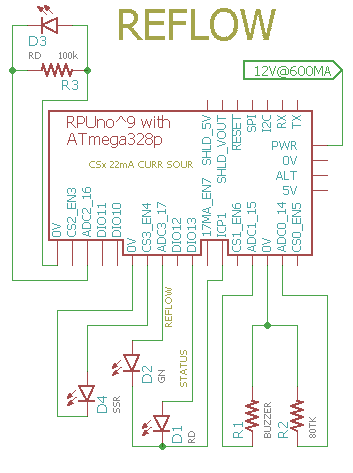

# Reflow

## Overview

__Not for multidrop use__ this firmware outputs to the serial after reset without being addressed.

Controls a 20A Solid State Relay (SSR) and a buzzer. 

Every two seconds a byte is taken from EEPROM to control the PWM rate of the SSR for the next two seconds. The thermocouple is not used for direct feedback control. The thermocouple is used to get the profile correct, but once set the profile is locked in. The idea is that any error in the software will show up each time, it will not be hidden by PID control logic. The starting condition of the oven needs to be near the same for each run, I find it takes at least fifteen minutes between runs.

Reads a Fluke 80TK Thermocouple Module (1mV/deg F) on channel zero. 


Do not modify the oven, if you modify it and it burns down your house the insurance may deny payment. Turn the knobs so it is always on (as shown in the image) and set the temperature high enough that it will not turn off the oven. Now the Solid State Relay (SSR) can modulate power to the heating elements, the modulation does not need to be fast since they have a long thermal response, in fact, a two second PWM is more than enough. The SSR also needs to be placed in a certified electrical enclosure to improve the chance of getting insurance to pay (I'm not an expert, and there are always more rules). 


A 255 value in EEPROM will turn on the buzzer on DIO3 for two seconds, while two consecutive values will terminate the profile. The program will otherwise run to the end of EEPROM memory.


# EEPROM Memory map 

A map of how this application uses the EEPROM. 

```
function                    type        ee_addr:
Adc::id                     UINT16      30
Adc::ref_extern_avcc        UINT32      32
Adc::ref_intern_1v1         UINT32      36
Reflow::id                  UINT16      40
Reflow::pwm                 UINT8       42
...
Reflow::pwm                 UINT8       1024
```

pwm values used by Reflow start at address 42.


# Wiring to RPUno




# Profile

The profile sub folder has the Python3 program that I use to load the profile. 


# Notes

I Used a Fluke 80TK Thermocouple Module set to Fahrenheit scale so the output voltage runs up to almost .5V, and set the ADC to use the internal 1.1V bandgap referance and that means nearly half that ADC scale is used. 


# Firmware Upload

With a serial port connection (set the BOOT_PORT in Makefile) and optiboot installed on the Atmega328 board run 'make bootload' and it should compile and then flash the MCU.

``` 
rsutherland@straightneck:~/Samba/RPUno/Reflow$ make bootload
...
avrdude done.  Thank you.
``` 

Now connect with picocom (or ilk). Note I am often at another computer doing this through SSH. The Samba folder is for editing the files from Windows.

``` 
#exit picocom with C-a, C-x
picocom -b 38400 /dev/ttyUSB0
``` 

log a terminal session to check the profile

``` 
script -f -c "picocom -b 38400 /dev/ttyUSB0" stuff.log
``` 


# Commands

Commands are interactive over the serial interface at 38400 baud rate. The echo will start after the second character of a new line. 


## /\[rpu_address\]/\[command \[arg\]\]

rpu_address is taken from the I2C address 0x29 (e.g. get_Rpu_address() which is included form ../lib/rpu_mgr.h). The value of rpu_address is used as a character in a string, which means don't use a null value (C strings are null terminated) as an adddress. The ASCII value for '1' (0x31) is easy and looks nice, though I fear it will cause some confusion when it is discovered that the actual address value is 49.

Commands and their arguments follow.

## /0/id? \[name|desc|avr-gcc\]

identify 

``` 
/1/id?
{"id":{"name":"Reflow","desc":"RPUno (14140^7) Board /w atmega328p","avr-gcc":"4.9"}}
```

## /0/reflow?

Start the reflow profile and read the Fluke 80TK Thermocouple Module set to Fahrenheit scale on analog channel zero.

``` 
/1/reflow?
{"millis":"10","pwm":"255","deg_c":"26.11"}
{"millis":"2010","pwm":"50","deg_c":"26.11"}
```

## [/0/ee? address\[,type\]](../Eeprom#0ee-addresstype)


## [/0/ee address,value\[,type\]](../Eeprom#0ee-addressvaluetype)


## [/0/iscan?](../i2c-debug#0iscan)


## [/0/iaddr 0..127](../i2c-debug#0iaddr-0127)


## [/0/ibuff 0..255\[,0..255\[,0..255\[,0..255\[,0..255\]\]\]\]](../i2c-debug#0ibuff-02550255025502550255)


## [/0/ibuff?](../i2c-debug#0ibuff)


## [/0/iwrite](../i2c-debug#0iwrite)