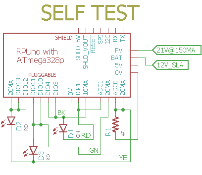

# Self-Test

## Overview

Check RPUno Board Functions, runs once after a reset and then loops in a blink led section.

Current sources feed a 50 Ohm resistor and that is measured with ADC0. One of the 22mA digital current source connect to DIO13 and DIO12 befor going through a yellow LED and then feeding into the 50 Ohm resistor. The other 22mA digital current source connect to DIO3 and DIO10 befor going through a yellow LED and then feeding into the 50 Ohm resistor. The 22mA ADC0 current source connects to DIO11 befor going through a red LED and feeding into the 50 Ohm resistor. 

ICP1 has a 100 Ohm resistor on board and a 10mA current source jumper that feeds it, the voltage is measured with ADC1. Additionaly a 17mA current source is connected to DIO4 and feeds the ICP1 resistor through a green LED. 

The red and green LED are also used to indicate test status.

## Wiring Needed for RPUno




## Power Supply

Connect a power supply with CV and CC mode. Set CC at 300mA then increase CV to 12.8V.


## Firmware Upload

With a serial port connection (set the BOOT_PORT in Makefile) and optiboot installed on the RPUno run 'make bootload' and it should compile and then flash the MCU.

``` 
rsutherland@conversion:~/Samba/RPUno/SelfTest$ make bootload
...
avr-size -C --mcu=atmega328p SelfTest.elf
AVR Memory Usage
----------------
Device: atmega328p

Program:   11824 bytes (36.1% Full)
(.text + .data + .bootloader)

Data:        260 bytes (12.7% Full)
(.data + .bss + .noinit)
...
avrdude -v -p atmega328p -c arduino -P /dev/ttyUSB0 -b 115200 -U flash:w:SelfTest.hex
...
avrdude done.  Thank you.
rsutherland@conversion:~/Samba/RPUno/SelfTest$ make clean
rm -f SelfTest.hex SelfTest.map
``` 

Now connect with picocom (exit is C-a, C-x). 

``` 
rsutherland@conversion:~/Samba/RPUno/SelfTest$ picocom -b 38400 /dev/ttyUSB0
picocom v1.7
...
Terminal ready
Self Test date: Oct 21 2017
I2C provided address 0x31 from RPU bus manager
REF_EXTERN_AVCC saved in eeprom: 4.944 V
PWR_I with CS_EN==off: 0.055 A
PWR at: 12.668 V
ADC0 /w shunts on & CS_EN==off: 0.000 V
ADC1 /w shunts on & CS_EN==off: 0.000 V
ICP1 /w 0mA on plug termination reads: 1 
PWR_I with CS_EN==on: 0.125 A
ADC1_22mA source on R1: 0.023 A
ICP1's 10mA on ICP1_TERM: 0.010 A
ICP1 /w 10mA on plug termination reads: 0 
Add DIO11_22MA curr source to R1: 0.042 A
DIO12 shunting DIO11_22mA: 0.025 A
DIO13 shunting DIO11_22mA: 0.024 A
Add DIO3_22MA curr source to R1: 0.042 A
DIO10 shunting DIO3_22mA: 0.024 A
DIO3 shunting DIO3_22mA: 0.024 A
ICP1 10mA + 17mA curr source on ICP1's PL plug: 0.027 A
[PASS]

``` 
