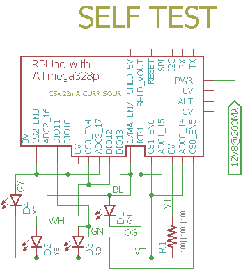

# Self-Test

## Overview

Check RPUno Board Functions, runs once after a reset and then loops in a do noting section.

Three 20mA current sources feed a 47 Ohm resistor and that is measured with ADC0. The 20mA digital current source connects to DIO13 and DIO12 befor going through a red LED and then feeding into the 47 Ohm resistor. The 20mA ADC1 current source connects to DIO11 and DIO10 befor going through a red LED and then feeding into the 47 Ohm resistor. 

If DIO12 or DIO13 shunt the digital current sources the ADC0's measurement is 20mA less. If DIO11 or DIO10 shunt the ADC1 current source then ADC0's measurement is 20mA less. 

ICP1 has a 100 Ohm resistor on board and a 10mA current source jumper that feeds it, the voltage is measured with ADC1. Additionaly a 16mA current source is connected to DIO3 and DIO4 and feeds the ICP1 resistor through a green LED. 

If DIO3 or DIO4 shunt the 16mA current source then ADC1's measurement is less by 16mA.

The red and green LED are used to indicate test status.

## Wiring Needed for RPUno



## Battery

Connect a fairly large 12V SLA battery and a 100k Ohm resistor to the battery thermistor input. The test looks for an MPPT voltage so the battery should be less than the float voltage. 

The battery needs to charge to 13.1V before the VIN that powers MCU will connect. A large battery will give sufficient time to load the firmware and run a test before float voltage reached and the MPPT mode terminates.

## Power Supply

Connect a power supply with CV and CC mode. Set CC at 150mA then increase CV to 21V. The charge controler will turn on and regulate the input voltage at its MPPT (assuming the battery is not at its float voltage). 

Note: I adjust CC to speed up charging until VIN connects and then return it to the 150mA setting.

## Firmware Upload

With a serial port connection (set the BOOT_PORT in Makefile) and optiboot installed on the RPUno run 'make bootload' and it should compile and then flash the MCU.

``` 
rsutherland@conversion:~/Samba/RPUno/SelfTest$ make bootload
...
avr-size -C --mcu=atmega328p SelfTest.elf
AVR Memory Usage
----------------
Device: atmega328p

Program:   11168 bytes (34.1% Full)
(.text + .data + .bootloader)

Data:        240 bytes (11.7% Full)
(.data + .bss + .noinit)
...
avrdude -v -p atmega328p -c arduino -P /dev/ttyUSB0 -b 115200 -U flash:w:SelfTest.hex
...
avrdude done.  Thank you.
rsutherland@conversion:~/Samba/RPUno/SelfTest$ make clean
rm -f SelfTest.hex SelfTest.map
``` 

Now connect with picocom (or ilk). 

``` 
#exit is C-a, C-x
rsutherland@conversion:~/Samba/RPUno/SelfTest$ picocom -b 38400 /dev/ttyUSB0
picocom v1.7
...
Terminal ready
I2C provided address 0x31 from RPU bus manager
+5V needs measured and then set as ADC_REF: 4.950 A
Charging with CURR_SOUR_EN==off: 0.105 A
PWR (Battery) at: 13.559 V
MPPT at: 16.999 V
ADC0 at: 0.000 V
ADC1 at: 0.000 V
ICP1 /w 0mA on plug termination reads: 1
CC_nFAULT measured with a weak pull-up: 1
Charging delta with CURR_SOUR_EN==on: 0.085 A
ADC0 with its own 20mA source on R1: 0.022 A
ADC1 with ICP1's 10mA on ICP1_TERM: 0.010 A
ICP1 /w 10mA on plug termination reads: 0
Dischrging at: 0.101 A
ADC0 and digital curr source on R1: 0.043 A
ADC0 measure curr on R1 with DIO12 shunting: 0.028 A
ADC0 measure curr on R1 with DIO13 shunting: 0.028 A
ADC0 and ADC1 curr source on R1: 0.043 A
ADC0 measure curr on R1 with DIO10 shunting: 0.028 A
ADC0 measure curr on R1 with DIO11 shunting: 0.028 A
[PASS]
``` 