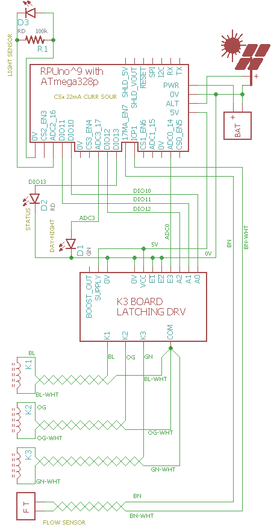

# Solenoid Control 

## Future improvements (to do)

__Do not use this program__ the updates need verified on ^9.

turn on flow sensor current source CS_ICP1_EN. (done)

Add a wiring diagram. (done)

report "stop" command like on DayNight 
/1/stop 1 
{"K1":{"delay_start_sec":"1","runtime_sec":"1","delay_sec":"1","cycles":"1"}}
(done)

Irrigation valve got stuck. Check if the flow meter has stopped when the valve was closed, try to close the valve again a few times. Set a status value for the command line to read, and sort out a way to do a service request, perhaps with the bus manager.

Plants need more water when they get more sun. Add an option to scale the mount of water based on integration of the light sensor. 

## Overview

Solenoid is an interactive command line program that demonstrates control of the K3 latching solenoid driver board using the I/O pins on an ATmega328p. 

Solenoid uses non-blocking timers in its SolenoidControl() function to cycle through the K[1|2|3].cycle_state that is used to control the latching solenoids. Each night the Night_AttachWork event runs. I have it disable the alternate power input. Each day the Day_AttachWork event runs. I have this event enable the alternate power input, clear counters, LoadSolenoidControlFromEEPROM(), and StartSolenoid().

A 12V AGM LA battery is connected to the main power input. A solar panel is connected to the Alternate power input to allow charging the battery.  The Day_AttachWork() function is given a callback that is used to reset the accumulation values.

+The solar panel short-circuit current needs to be less than about 1.5A so an SLP020-12U with Isc 1.3A should work, however an SLP030-12U with Isc 1.93 is too much. The battery should charge at 0.1C so for an SLP020-12U it needs to be at least 13AHr. If the charging is about 50% efficient then I will only get back about 3.25AHr of the 6.5AHr that was put in during a 5Hr charging time (that is about what I see). For a reasonable life expectancy, the battery should not discharge more than about 20%, so a minimum size that will do several hundred charge cycles is 16.25AHr.


## Wiring K3 to RPUno

``` 
ATmega328p RPUno       K3      function
-----------------------------------------
PC0        DIO14       E3      74HC238 ENABLE 
PC3        DIO17       na      DAY-NIGHT STATUS LED
0V         na          nE2
0V         na          nE1
PB2        DIO10       A0      74HC238 ADDRESS 0
PB3        DIO11       A1      74HC238 ADDRESS 1
PB4        DIO12       A2      74HC238 ADDRESS 2
PB5        DIO13       na      STATUS LED
PC2        ADC2        na      LIGHT SENSOR
PB0        ICP1        na      FLOW SENSOR
PD7        CS_ICP1_EN  na      CURR SOUR
``` 



The RPUno has the indicated DIO's wired to 3.5mm pads. They are level converted to 5V so will ouput about 4V without a pullup (which is enough for a minimum high on 74HC logic). 

The STATUS_LED blinks on and off for a second when an rpu_address is read over I2C (if I2C failed it blinks four times as fast). 


# EEPROM Memory map 

A map of the solenoid settings in EEPROM. 

```
function            type    ee_addr:K1  K2  K3
id                  UINT16          40  60  80
delay_start_sec     UINT32          42  62  82
runtime_sec         UINT32          46  66  86
delay_sec           UINT32          50  70  90
flow_stop           UINT32          54  74  94
cycles              UINT8           58  78  98
```


# Start of Day 

The [day-night][../DayNight] state machine is used to load and run EEPROM values after the morning debounce. This means the valves will start to cycle after the delay_start time has elapsed each morning.


# Flow Sensor

ICP1 is available through the [Capture][../Capture] commands. The differance in capture counts is held as flow data for each zone and its value is part of the flow report (see /flow? command).


# Firmware Upload

With a serial port connection (set the BOOT_PORT in Makefile) and optiboot installed on the RPUno run 'make bootload' and it should compile and then flash the MCU.

``` 
sudo apt-get install git gcc-avr binutils-avr gdb-avr avr-libc avrdude
git clone https://github.com/epccs/RPUno/
cd /RPUno/Solenoid
make bootload
...
avrdude done.  Thank you.
``` 

Now connect with picocom (or ilk).

``` 
#exit is C-a, C-x
picocom -b 38400 /dev/ttyUSB0
``` 


# Commands

Commands are interactive over the serial interface at 38400 baud rate. The echo will start after the second character of a new line. 


## /\[rpu_address\]/\[command \[arg\]\]

rpu_address is taken from the I2C address 0x29 (e.g. ../Uart/id.h get_Rpu_address() ). The value of rpu_address is used as a character in a string, which means don't use a null value (C strings are null terminated), but the ASCII value for '1' (0x31) is easy and looks nice, though I fear it will cause some confusion when it is discovered that the actual address value is 49.

The STATUS_LED is bliked fast (twice per second) if the I2C address is not found, also the rpu_address defaults to '0'. 

Commands and their arguments follow.


## /0/id? \[name|desc|avr-gcc\]

Identify is from ../Uart/id.h Id().

``` 
/1/id?
{"id":{"name":"Solenoid","desc":"RPUno Board /w atmega328p and LT3652","avr-gcc":"4.9"}}
```


##  /0/krun k\[,cycles\] 

Start the solenoid k (1|2|3) operation, with option to override cycles (1..255). 

If EEPROM does not have settings the solenoids retains initialized values (delay_start = 1..7, runtime= 1, delay = 3600, flow_stop = not used) that will cause each solenoid to operate for a second after a delay_start time that spaces there operation out by 3 seconds each (it insures all are in a known state).

After a solenoid has entered the delay state and let go of the flow meter resource another solenoid that is ready to use the flow meter will do so. Make sure to set the delay time long enough that all the other solenoids can use their runtime, or the flow meter becomes a resource constraint and some zones will get shorted. For example set all the delay times to 360 and make sure the combined runtimes do not add up to 360 (i.e. 100, 80, 120).

```
/1/krun 1,1
{"K1":{"delay_start_sec":"1","runtime_Sec":"1","delay_Sec":"3600","cycles":"1"}}
/1/krun 2,1
{"K2":{"delay_start_sec":"4","runtime_Sec":"1","delay_Sec":"3600","cycles":"1"}}
/1/krun 3,1
{"K3":{"delay_start_sec":"7","runtime_Sec":"1","delay_Sec":"3600","cycles":"1"}}
```


##  /0/ksave k,cycles 

Save the solenoid k (1|2|3) with cycles (1..255) to EEPROM, it can then autostart.

Saved settings are loaded and operated at the start of each day.

```
/1/ksave 1,10
{"K1":{"delay_start_sec":"3","runtime_Sec":"10","delay_Sec":"40","cycles":"10"}}
/1/ksave 2,10
{"K2":{"delay_start_sec":"16","runtime_Sec":"10","delay_Sec":"40","cycles":"10"}}
/1/ksave 3,10
{"K3":{"delay_start_sec":"29","runtime_Sec":"10","delay_Sec":"40","cycles":"10"}}
```

##  /0/kload k

Load the solenoid k (1|2|3) from EEPROM. Use run to start it.

```
/1/kload 1
{"K1":{"delay_start_sec":"10","runtime_Sec":"15","delay_Sec":"60","cycles":"10"}}
/1/kload 2
{"K2":{"delay_start_sec":"30","runtime_Sec":"15","delay_Sec":"60","cycles":"10"}}
/1/kload 3
{"K3":{"delay_start_sec":"50","runtime_Sec":"15","delay_Sec":"60","cycles":"10"}}
```


##  /0/kstop k 

Reduce the delay_start, runtime, and delay to one second each to stop the solenoid k (1|2|3) operation.

To change the solenoids setting use /stop, then /load, and change the desired setting (e.g. /runtime) and finally save it and perhaps /run it.

```
/1/kstop 1
{"K1":{"stop_time_sec":"3"}}
```


##  /0/kpre k,delay_start_in_sec

Set the solenoid k (1|2|3) one time delay befor cycles run (1..21600, e.g. 6hr max). 

``` 
/1/kpre 1,3
{"K1":{"delay_start_sec":"3"}}
/1/kpre 2,16
{"K2":{"delay_start_sec":"16"}}
/1/kpre 3,29
{"K3":{"delay_start_sec":"29"}}
/1/krun 2,1
{"K2":{"delay_start_sec":"16","runtime_sec":"10","delay_sec":"40","cycles":"1"}}
``` 


##  /0/krunt k,runtime_in_sec

Set the solenoid k (1|2|3) run time (1..21600, e.g. 6hr max). 

``` 
/1/krunt 1,10
{"K1":{"runtime_sec":"10"}}
/1/krunt 2,10
{"K2":{"runtime_sec":"10"}}
/1/krunt 3,10
{"K3":{"runtime_sec":"10"}}
/1/krun 1,1
{"K1":{"delay_start_sec":"2","runtime_sec":"10","delay_sec":"40","cycles":"1"}}
```


##  /0/kdelay k,delay_in_sec

Set the solenoid k (1|2|3) delay between runs (1..86400, e.g. 24 hr max). 

```
/1/kdelay 1,40
{"K1":{"delay_sec":"40"}}
/1/kdelay 2,40
{"K2":{"delay_sec":"40"}}
/1/kdelay 3,40
{"K3":{"delay_sec":"40"}}
/1/krun 3,1
{"K3":{"delay_start_sec":"7","runtime_sec":"1","delay_sec":"40","cycles":"1"}}
```


##  /0/kfstop k,flow_stop

Set the solenoid k (1|2|3) flow_stop (1..0xFFFFFFFF) that also stops the solenoid (e.g. when flow count is reached).

``` 
/1/kfstop 3,500
{"K3":{"flow_stop":"500"}}
/1/krun 3,1
{"K3":{"delay_start_sec":"10","runtime_sec":"20","delay_sec":"40","cycles":"1","flow_stop":"500"}}
``` 


##  /0/kflow? k

Report the solenoid k (1|2|3) flow_cnt or pulses events on ICP1.

``` 
/1/kflow? 3
{"K3":{"cycle_state":"11","cycles":"7","flow_cnt":"0"}}
``` 


##  /0/ktime? k

Report the solenoid k (1|2|3) runtime in millis.

``` 
/1/ktime? 3
{"K3":{"cycle_state":"11","cycles":"9","cycle_millis":"15000"}}
``` 


## [/0/analog? 0..7\[,0..7\[,0..7\[,0..7\[,0..7\]\]\]\]](../Adc#0analog-0707070707)


## [/0/iscan?](../i2c-debug#0iscan)


## [/0/iaddr 0..127](../i2c-debug#0iaddr-0127)


## [/0/ibuff 0..255\[,0..255\[,0..255\[,0..255\[,0..255\]\]\]\]](../i2c-debug#0ibuff-02550255025502550255)


## [/0/ibuff?](../i2c-debug#0ibuff)


## [/0/iwrite](../i2c-debug#0iwrite)


## [/0/charge?](../AmpHr#0charge)


## [/0/day?](../DayNight#0day)


## [/0/alt](../Alternat#0alt)


## [/0/altcnt?](../Alternat#0altcnt)


## [/0/initICP icp1,mode,prescale](../Capture#0initicp-icp1modeprescale)


## [/0/count? \[icp1\]](../Capture#0count-icp1)


## [/0/capture? \[icp1,1..15\]](../Capture#0capture-icp1115)


## [/0/event? \[icp1,1..31\]](../Capture#0event-icp1131)


