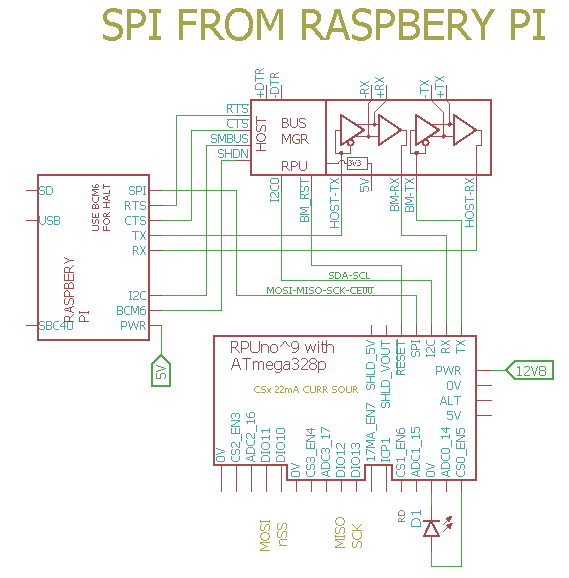

# AVR  Interrupt-Driven SPI slave

## Overview

SPI slave with an interactive command line program. DIO4 is used as status LED. DIO3 can be used to drive nSS (which is on DIO10) to enable slave functions (Note: nSS is not connected to the Pi Zero).


## Pi SPI

After loading this RPUno firmware and enabling the AVR's SPI we can test the interface with the Raspberry Pi [SPI] hardware. Raspian needs its [SPI] master driver enabled (e.g. [raspi-config]).

[SPI]: https://www.raspberrypi.org/documentation/hardware/raspberrypi/spi/README.md
[raspi-config]: https://www.raspberrypi.org/documentation/configuration/raspi-config.md

Raspibin has an spi group setup in /etc/udev/rules.d/99-com.rules. I just need to add my user name to the group for the system to allow me to use the device.

``` 
sudo usermod -a -G spi rsutherland
# logout for the change to take
``` 

Compile spidev_test.c on the Pi with:

``` 
wget https://raw.githubusercontent.com/raspberrypi/linux/rpi-3.10.y/Documentation/spi/spidev_test.c
gcc -o spidev_test spidev_test.c
# run with
./spidev_test -s 100000 -D /dev/spidev0.0
./spidev_test -s 500000 -D /dev/spidev0.0
./spidev_test -s 1000000 -D /dev/spidev0.0
./spidev_test -s 2000000 -D /dev/spidev0.0
./spidev_test -s 500000 -D /dev/spidev0.0
./spidev_test -s 500000 -D /dev/spidev0.0

spi mode: 0
bits per word: 8
max speed: 500000 Hz (500 KHz)

0D FF FF FF FF FF
FF 40 00 00 00 00
95 FF FF FF FF FF
FF FF FF FF FF FF
FF FF FF FF FF FF
FF DE AD BE EF BA
AD F0
``` 

Note: The output is offset a byte since it was sent back from the AVR. I see errors at 1MHz and 2MHz. The RPUpi^3 has a 74LVC07 buffer that pulls down through a 10kOhm resistor on SCK and MOSI. The circuit between that resistor and the AVR has some capacitance which will limit the speed (if there is a need for higher speed it may be possible to swap in a 1k resistor).


## Wiring Setup




## Firmware Upload

With a serial port connection (set the BOOT_PORT in Makefile) and optiboot installed on the RPUno run 'make bootload' and it should compile and then flash the MCU.

``` 
rsutherland@pi1:~/Samba/RPUno/SpiSlv$ make bootload
...
avrdude done.  Thank you.
``` 

Now connect with picocom (or ilk). Note I am using a Headless Pi Zero (e.g. through SSH). The Samba folder is for editing the files from Windows.

``` 
#exit is C-a, C-x
picocom -b 38400 /dev/ttyAMA0
# setup bus manager using sneaky mode (requires I2C commands in firmware)
/1/iaddr 41
{"address":"0x29"}
/1/ibuff 3,49
{"txBuffer[2]":[{"data":"0x3"},{"data":"0x31"}]}
/1/iread? 2
{"rxBuffer":[{"data":"0x3"},{"data":"0x31"}]}
/1/ibuff 7,0
{"txBuffer[2]":[{"data":"0x7"},{"data":"0x0"}]}
/1/iread? 2
``` 

# Commands

Commands are interactive over the serial interface at 38400 baud rate. The echo will start after the second character of a new line. 

## /0/id? [name|desc|avr-gcc]

identify 

``` 
/1/id?
{"id":{"name":"SpiSlv","desc":"RPUno (14140^7) Board /w atmega328p","avr-gcc":"4.8"}}
``` 


## /0/spi UP|DOWN

Turn on SPI. This enables SPI slave mode which exchanges data in shift registers. An UP will pull down DIO3 and enable the SPI hardware, DIO3 can be connected to nSS (a.k.a. DIO10) so that it activates the SPI slave hardware (nSS can also be connected to 0V). 

``` 
/1/spi UP
{"SPI":"UP"}
``` 
