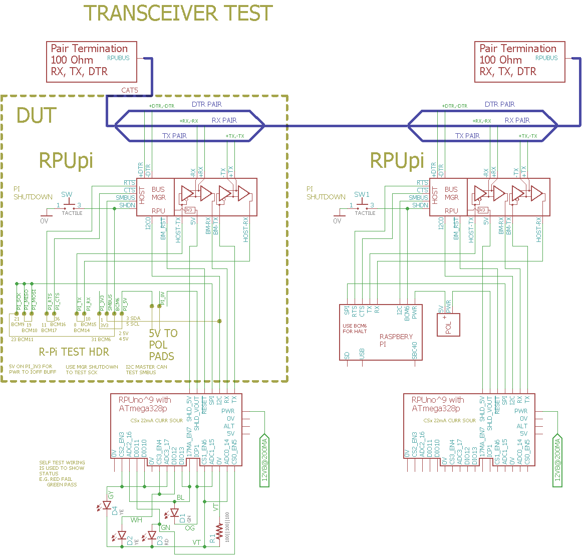

# Transceiver Test

## Overview

Check Transceivers on an RPUpi, this runs once after a reset and then loops in a pass/fail section.

Test commands are issued to the manager's I2C port to operate it in test_mode. The manager needs to be loaded with its firmware (e.g., RPUpi's [Remote] firmware) 

[Remote]: https://github.com/epccs/RPUpi/tree/master/Remote

The wiring (from SelfTest) has a red and green LED that blink to indicate test status.

## Wiring Needed for Transceiver Test




## Power Supply

Connect a power supply with CV and CC mode. Set CC at 200mA and CV at 12.8V.


## Firmware Upload

The wiring shows two RPUpi (one is the DUT) and two RPUno. An R-Pi Zero is used as a host on the know good RPUno and its RPUpi. [Remote] has been loaded on the known good and DUT RPUpi's.

[Remote]: https://github.com/epccs/RPUpi/tree/master/Remote

The known good RPUno has been loaded with [i2c-debug]. 

[i2c-debug]: https://github.com/epccs/RPUno/tree/master/i2c-debug

Connect the bootload port of the RPUno that will be under the DUT with [USBuart] or [ICSP] and load this test firmware on it, run 'make' to build and then 'make bootload' to flash it. 

[ICSP]: https://github.com/epccs/Driver/tree/master/ICSP
[USBuart]: https://github.com/epccs/Driver/tree/master/USBuart

``` 
git clone https://github.com/epccs/RPUno/
cd /RPUno/XcvrTest
make
make bootload
...
avrdude done.  Thank you.
make clean
``` 

Now power down the RPUno with the loaded test firmware and plug in the DUT. When the power is applied the test will run and we can see the resutls on the Bootload port with [USBuart] and picocom (exit is C-a, C-x). 

``` 
picocom -b 38400 /dev/ttyUSB0
picocom v2.2
...
Terminal ready
RPUpi Transceiver Test date: Jul  7 2019
avr-gcc --version: 5.4.0
I2C provided address 0x31 from manager
SMBUS cmd 0 provided address 49 from manager
MISO loopback to MOSI == HIGH
MISO loopback to MOSI == LOW
SCK with Shutdown loopbakc == HIGH
I2C Shutdown cmd is clean {5, 1}
SCK with Shutdown loopbakc == LOW
I2C Shutdown Detect cmd is clean {4, 1}

Testmode: default trancever control bits
I2C Start Test Mode cmd was clean {48, 1}
I2C End Test Mode hex is Xcvr cntl bits {49, 0xD5}
Testmode: read  Xcvr cntl bits {50, 0xE2}

Testmode: nCTS loopback to nRTS
I2C Start Test Mode cmd was clean {48, 1}
I2C End Test Mode hex is Xcvr cntl bits {49, 0xD5}
Testmode: set  Xcvr cntl bits {51, 0xA2}
Testmode: read  Xcvr cntl bits {50, 0x22}
[PASS]
```

The resutls can also be seen on the remote R-Pi host, but if something goes wrong the bootload port may be needed to see the test results.

The test is not done, I will start working on it soon.

It needs to place the manager in test mode and measure quit a few things and then exit test mode and write the results to serial. 

I was a test engineer for many years, I use to think about testing from the outside into the inside, but this is from the inside to the outside. If the test fails the bootload port will be needed, I fear that during the analysis the host UART connected to the bootload port will be trashed with garbage, but I think clean data can be sent after the trash.

