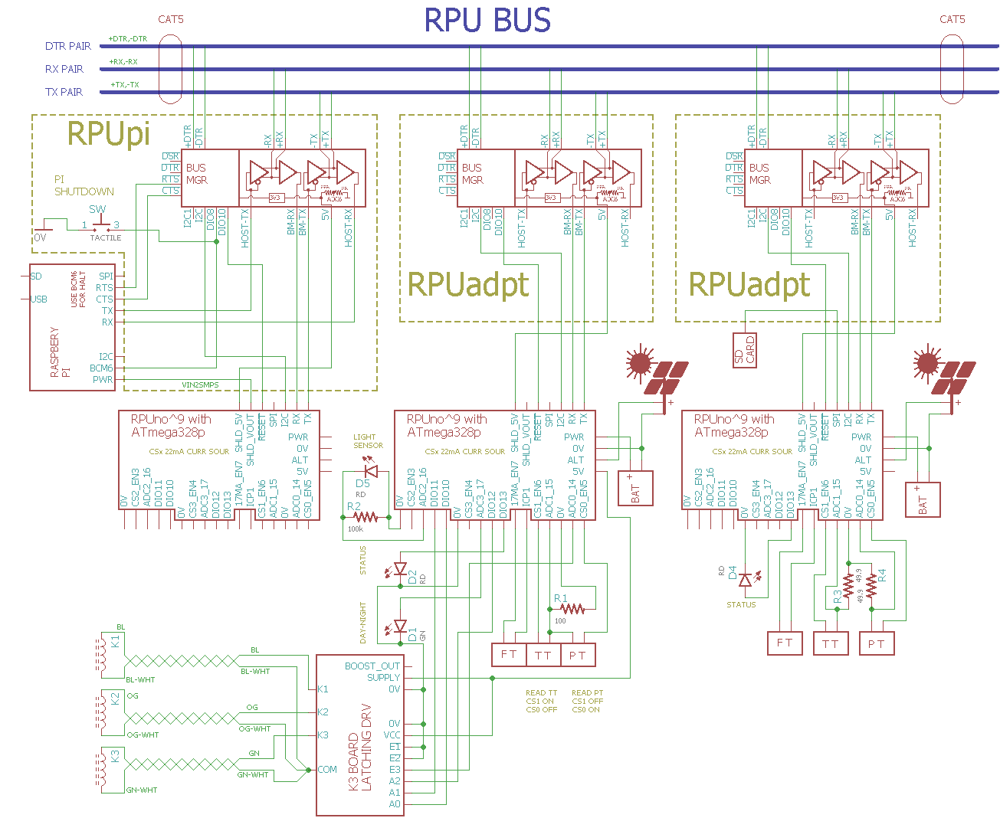

# RPUno 

From <https://github.com/epccs/RPUno/>

## Overview

A general purpose ATmega328p controller board with level shift IO and current sources that operate over the wide input voltage range.

The bare metal microcontroller on this board is the same as an Arduino Uno. I use it to evaluate the examples Arduino has. Normally C is my preference so converting Arduino's C++ into C adds some overhead, the toolchain supports both but C causes fewer surprises since it is implemented with a stack-based memory system (C++ needs the heap for its features). The toolchain is available on most Linux distributions, a Raspberry Pi makes a nice remote computer and can handle networking services robustly. Logging into the remote computer is done with SSH and updates for the controller are done by pulling from GitHub and then using make to run the "Makefile" rules that compile and upload firmware over a serial link. Mezzanine boards [RPUadpt] and [RPUpi] can be used to add multidrop serial. The mezzanine VIN pin can be disconnected with an onboard P-channel MOSFET to remove power from the Raspberry Pi computer.

[RPUadpt]: https://github.com/epccs/RPUadpt
[RPUpi]: https://github.com/epccs/RPUpi

[Forum](http://rpubus.org/bb/viewforum.php?f=6)

[HackaDay](https://hackaday.io/project/12784-rpuno)

## Status

Available through [Tindie](https://www.tindie.com/products/8862/)

[](https://travis-ci.org/epccs/RPUno)


## [Hardware](./Hardware)

Hardware files and notes for referance.

## Example with RPU BUS

This example shows a multidrop serial bus that has several microcontroller boards connected to a single Raspberry Pi computer. Linux on the single board computer controls a hardware UART (/dev/ttyAMA0) that has serial lines connected to a transceiver and its differental pairs. The remote boards have an [RPUadpt] mezzanine board and CAT5 cable daisy-chain between them. 

[Irrigate7]: https://github.com/epccs/Irrigate7



The transceivers are automatically activated, so common serial programs (e.g. avrdude, PySerial, picocom, and UART libraries) work without modification, but care must be taken to ensure only one controller answeres a host command. Each mezzanine board has a bus manager that is used to disconnect all the serial devices when the host connects, only the bootload target controller is connected. The host tells the manager what target to bootload over I2C (from the controller, I have not yet got a 328pb working which has two I2C interfaces, one for the host and one for the controller). When the target runs its application and reads the bus address over I2C from the manager the manager broadcast a normal mode state that causes all the managers to connect their controller.

I rely on a Command Line Interface (CLI) to the controllers. The CLI responds to commands terminated with a newline (inspired by console), press enter (which sends a newline) to start a command. The command includes an address with the first two bytes, but echo starts after the second byte is sent. The first byte will cause any transmitting device to stop and dump its outgoing buffer which prevents collisions in the data from the controllers to the host. The command length is also limited to allow the use of optimized buffer size.

As a short example, I'll connect with SSH (e.g. from a Windows 1803 build) to a Raspberry Pi Zero board. These machines have matching usernames and there SSH keys and known host file was set during a previous session. Once on the armv61 machine, I use picocom to interact with two different control boards. They are on the same serial bus at addresses '/1' and '/0' (note that ASCII '1' is 0x31, and ASCII '0' is 0x30, so they have an address that looks good on picocom but is probably not what was expected).  

```
C:\Users\rsutherland>ssh pi1.local
Linux pi1 4.14.34+ #1110 Mon Apr 16 14:51:42 BST 2018 armv6l

The programs included with the Debian GNU/Linux system are free software;
the exact distribution terms for each program are described in the
individual files in /usr/share/doc/*/copyright.

Debian GNU/Linux comes with ABSOLUTELY NO WARRANTY, to the extent
permitted by applicable law.
Last login: Thu May 17 23:58:20 2018 from 192.168.0.19
rsutherland@pi1:~ $ picocom -b 38400 /dev/ttyAMA0
picocom v1.7

port is        : /dev/ttyAMA0
flowcontrol    : none
baudrate is    : 38400
parity is      : none
databits are   : 8
escape is      : C-a
local echo is  : no
noinit is      : no
noreset is     : no
nolock is      : no
send_cmd is    : sz -vv
receive_cmd is : rz -vv
imap is        :
omap is        :
emap is        : crcrlf,delbs,

Terminal ready
/0/id?
{"id":{"name":"NightLight","desc":"RPUno (14140^9) Board /w atmega328p","avr-gcc":"5.4.0"}}
/1/id?
{"id":{"name":"AmpHr","desc":"RPUlux (17323^2) Board /w atmega328p","avr-gcc":"5.4.0"}}
Ctrl-a,Ctrl-x 
Thanks for using picocom
rsutherland@pi1:~ $ exit
logout
Connection to pi1.local closed.

C:\Users\rsutherland>
```

At present, I'm using [I2Cdebug] to set the manager bootload address. 

[I2Cdebug]: ./i2c-debug

## AVR toolchain

The core files for this board are in the /lib folder. Each example has its files and a Makefile in its own folder. The toolchain packages that I use are available on Ubuntu and Raspbian. 

```
sudo apt-get install git gcc-avr binutils-avr gdb-avr avr-libc avrdude
git clone https://github.com/epccs/RPUno
```

* [gcc-avr](http://packages.ubuntu.com/search?keywords=gcc-avr)
* [binutils-avr](http://packages.ubuntu.com/search?keywords=binutils-avr)
* [gdb-avr](http://packages.ubuntu.com/search?keywords=gdb-avr)
* [avr-libc](http://packages.ubuntu.com/search?keywords=avr-libc)
* [avrdude](http://packages.ubuntu.com/search?keywords=avrdude)

I like to place a [Bootloader] on the bare metal microcontroler with an ISP tool. 

[Bootloader]: https://github.com/epccs/RPUno/tree/master/Bootloader

```
cd RPUno/Bootloader
# note /dev/ttyACM0 is my ICSP tool.
make fuse
make isp
```

The other applications are loaded through the bootloader using the host serial port. 

```
cd ~/RPUno/Adc
# note /dev/ttyUSB0 is my FTDI USBuart, and /dev/ttyAMA0 is my Raspberry Pi
make bootload
```

The software is a guide, it is in C because that is my preference when lacking an operating system.


## Continuous Integration

Continuous Integration (CI) is the practice of automatically compiling and testing each time the mainline source is updated (e.g. git push). Travis CI is using a painfully out of date version of Ubuntu (14.04) as there host environment for doing the test build. The build machine allows pulling in any packages I want including the AVR cross compiler. I don't do anything fancy, just run make. A rule like "make test" could be used if the test build machine had hardware connected (e.g. "make bootload" and then "make test") to the machine, but that is not practical in the foreseeable future. This board was painless to set up for Travis because the ATmega328p was in production and Arduino was so popular at that time.

[https://travis-ci.org/epccs/RPUno](https://travis-ci.org/epccs/RPUno)


## Arduino IDE

The Arduino IDE can use the [Uno's AVR core] files that are included (my [core] files are C rather than C++), just remember to look at the schematic to see how the "Uno" is connected. I do not use the Arduino core or C++.

[Uno's AVR core]: https://github.com/arduino/Arduino/tree/master/hardware/arduino/avr/cores/arduino
[core]: https://github.com/epccs/RPUlux/tree/master/lib


## Visual Studio Code

VSC is an editor with some IDE features, it is happy with Makefiles. The feature that is driving me to use VSC is [IntelliSense]. It is configured with JSON files in [.vscode]. 

[IntelliSense]: https://code.visualstudio.com/docs/editor/intellisense
[.vscode]: https://github.com/epccs/RPUno/tree/master/.vscode

IntelliSense needs access to the toolchain includes. The AVR toolchain has some in avr-libc (/usr/lib/avr/include), and gcc-avr (/usr/lib/gcc/avr/5.4.0/include). So I copy them into a Samba share for VSC to see (e.g. Y:/lib/avr-libc, and Y:/lib/gcc-avr) which is also where I edit the source (e.g. Y:/git/RPUno).
